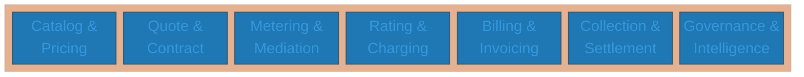
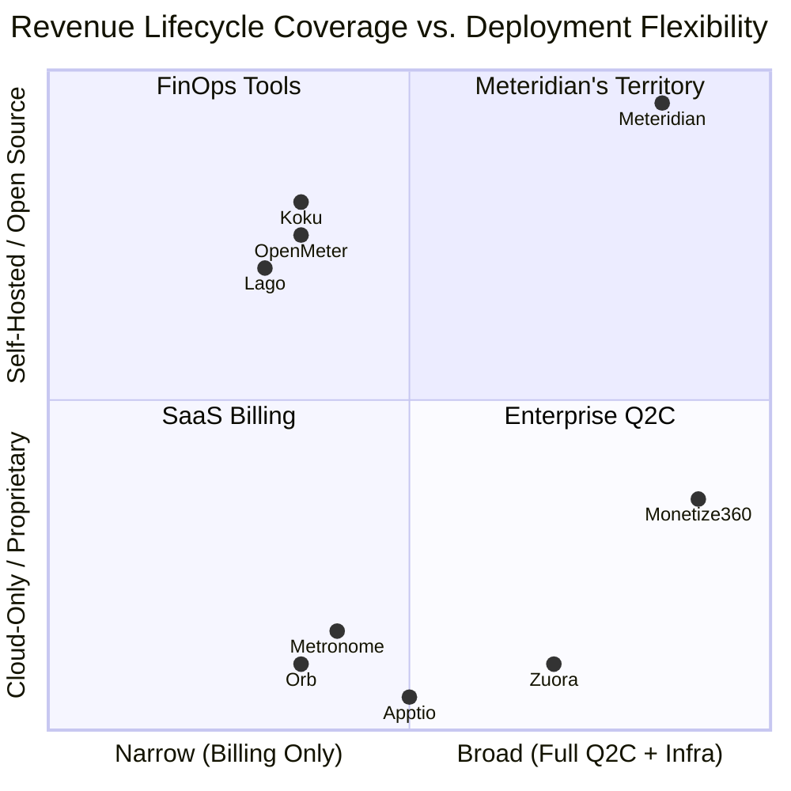
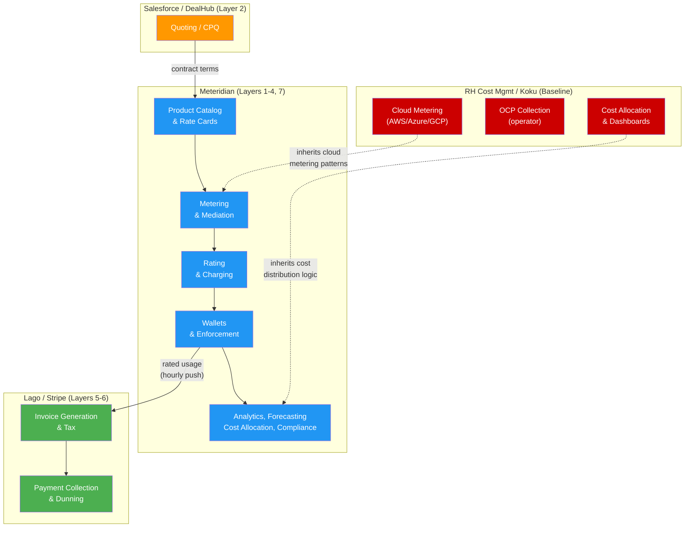

# Revenue Lifecycle: Phase/Module Comparison

**Last updated:** 2026-06-25
**Sources:** Monetize360 partner engineering deck, OpenMeter docs/GitHub, Meteridian enhancements (main + 12 open PRs), Red Hat Cost Management (Koku) codebase analysis, market research (Lago, Metronome/Stripe, Orb, Amberflo)

---

## Executive Summary

The revenue lifecycle from quote-to-cash spans **31 modules across 7 layers**.
Monetize360 claims "23 modules across 7 layers" in their partner deck — we
expand this to 31 by including infrastructure-specific, compliance, and
intelligence modules that the broader market requires.

### Coverage Summary

| Tool | Full | Partial | Planned | Delegates | None | Total Involvement |
|------|------|---------|---------|-----------|------|-------------------|
| **Monetize360** | 25 | 4 | 0 | 0 | 2 | 29/31 |
| **OpenMeter (Kong)** | 7 | 6 | 0 | 2 | 16 | 15/31 |
| **Meteridian** | 21 | 0 | 10 | 0 | 0 | 31/31 |
| **RH Cost Mgmt (Koku)** | 5 | 5 | 0 | 0 | 21 | 10/31 |
| **Lago** | 7 | 4 | 0 | 2 | 18 | 13/31 |
| **Metronome (Stripe)** | 6 | 5 | 0 | 2 | 18 | 13/31 |

**Key insight:** Koku covers 10/31 modules (the baseline). Meteridian is designed
as its successor, expanding from 10 to 31 module involvement (21 full + 10
planned). With all open PRs shipped, Meteridian covers every
module in the revenue lifecycle — no gaps remain — while being Apache 2.0,
on-premises-first, and covering infrastructure metering that no competitor can.

---

## Revenue Lifecycle Pipeline

```mermaid
flowchart LR
    subgraph L1["Layer 1: Catalog & Pricing"]
        direction TB
        M1["Product Catalog"]
        M2["Pricing / Rate Cards"]
        M3["Pricing Simulation"]
    end

    subgraph L2["Layer 2: Quote & Contract"]
        direction TB
        M4["Quoting / CPQ"]
        M5["Contract Management"]
        M6["Order Management"]
    end

    subgraph L3["Layer 3: Metering & Mediation"]
        direction TB
        M7["Metering / Data Collection"]
        M8["Mediation"]
        M9["Infrastructure Collectors"]
        M10["AI/ML Metering"]
        M11["Multi-Cloud Metering"]
    end

    subgraph L4["Layer 4: Rating & Charging"]
        direction TB
        M12["Rating / Charging Engine"]
        M13["Discounts / Promotions"]
        M14["Wallet / Credits / Prepaid"]
        M15["Entitlements / Access"]
        M16["Budget Enforcement"]
    end

    subgraph L5["Layer 5: Billing & Invoicing"]
        direction TB
        M17["Billing / Charge Calc"]
        M18["Invoice Generation"]
        M19["E-Invoicing / Compliance"]
        M20["Tax Calculation"]
        M21["Credit Notes / Adjustments"]
    end

    subgraph L6["Layer 6: Collection & Settlement"]
        direction TB
        M22["Payment Collection"]
        M23["Partner Settlement"]
        M24["Revenue Recognition"]
    end

    subgraph L7["Layer 7: Governance & Intelligence"]
        direction TB
        M25["Revenue Assurance"]
        M26["Analytics / BI"]
        M27["Unit Economics"]
        M28["Forecasting & Anomaly"]
        M29["Cost Allocation"]
        M30["Customer Portal"]
        M31["Legal / Compliance"]
    end

    L1 --> L2 --> L3 --> L4 --> L5 --> L6
    L3 --> L7
    L4 --> L7
    L5 --> L7
```



---

## Tool Coverage by Layer



| Layer | Monetize360 | OpenMeter | Meteridian | RH Cost Mgmt | Lago | Metronome |
|-------|:-----------:|:---------:|:----------:|:------------:|:----:|:---------:|
| **1. Catalog & Pricing** | 3/3 | 2/3 | 3/3 | 0/3 | 2/3 | 1/3 |
| **2. Quote & Contract** | 3/3 | 0/3 | 1/3 (+2†) | 0/3 | 0/3 | 1/3 |
| **3. Metering & Mediation** | 3/5 | 2/5 | 5/5 | 3/5 | 2/5 | 2/5 |
| **4. Rating & Charging** | 4/5 | 3/5 | 5/5 | 1/5 | 3/5 | 3/5 |
| **5. Billing & Invoicing** | 4/5 | 3/5 | 0/5 (+5†) | 0/5 | 4/5 | 3/5 |
| **6. Collection & Settlement** | 3/3 | 0/3 | 0/3 (+3†) | 0/3 | 0/3 | 0/3 |
| **7. Governance & Intelligence** | 5/7 | 1/7 | 7/7 | 4/7 | 1/7 | 1/7 |

† = open PR / planned

---

## Detailed Module Comparison

### Legend

| Symbol | Meaning |
|--------|---------|
| ✅ Full | Native, built-in capability |
| ⚠️ Partial | Limited or basic implementation |
| 🔵 Planned | Open PR / enhancement proposal in progress |
| ➡️ Delegates | Via integration (Stripe, Avalara, Lago, etc.) |
| ❌ None | Not supported, not planned |

---

### Layer 1: Catalog & Pricing

| # | Module | Monetize360 | OpenMeter | Meteridian | RH Cost Mgmt | Lago | Metronome |
|---|--------|:-----------:|:---------:|:----------:|:------------:|:----:|:---------:|
| 1 | Product Catalog | ✅ | ✅ | ✅ | ❌ | ✅ | ⚠️ |
| 2 | Pricing / Rate Cards | ✅ | ✅ | ✅ | ⚠️ | ✅ | ✅ |
| 3 | Pricing Simulation | ⚠️ | ❌ | ✅ | ❌ | ❌ | ❌ |

**Notes:**
- Koku has "cost models" (tiered_rates, tag_rates, markup) but these are cost allocation models, not a product catalog or full pricing engine
- Meteridian's pricing simulation (shadow rating engine replaying historical events) is unique in the market
- METR-0003 (open PR) details hierarchical catalog with versioning and effective dating

---

### Layer 2: Quote & Contract

| # | Module | Monetize360 | OpenMeter | Meteridian | RH Cost Mgmt | Lago | Metronome |
|---|--------|:-----------:|:---------:|:----------:|:------------:|:----:|:---------:|
| 4 | Quoting / CPQ | ✅ | ❌ | 🔵 | ❌ | ❌ | ❌ |
| 5 | Contract Management | ✅ | ❌ | ✅ | ❌ | ❌ | ✅ |
| 6 | Order Management | ✅ | ❌ | 🔵 | ❌ | ❌ | ❌ |

**Notes:**
- METR-0004 §4.0 (Quote Generation): lightweight quoting from Product Catalog + Pricing Simulation, with lifecycle FSM (draft → sent → accepted), Fluxo approval workflows, and automatic quote-to-contract conversion
- METR-0015 (Order Management): order lifecycle FSM (pending → provisioning → active → suspended → terminated), provisioning webhook/CloudEvent integration, metering activation, enforcement bridge
- Meteridian's quoting is deliberately minimal: no CPQ configurator, no guided selling. For complex deal desk workflows, integrate with Salesforce CPQ / DealHub via API.
- Order Management does NOT provision — it signals. K8s operators, Terraform, or Crossplane consume the provisioning events.

---

### Layer 3: Metering & Mediation

| # | Module | Monetize360 | OpenMeter | Meteridian | RH Cost Mgmt | Lago | Metronome |
|---|--------|:-----------:|:---------:|:----------:|:------------:|:----:|:---------:|
| 7 | Metering / Data Collection | ✅ | ✅ | ✅ | ✅ | ✅ | ✅ |
| 8 | Mediation | ✅ | ⚠️ | ✅ | ⚠️ | ⚠️ | ⚠️ |
| 9 | Infrastructure Collectors | ❌ | ❌ | ✅ | ⚠️ | ❌ | ❌ |
| 10 | AI/ML Metering | ✅ | ⚠️ | ✅ | ⚠️ | ❌ | ⚠️ |
| 11 | Multi-Cloud Metering | ⚠️ | ❌ | ✅ | ✅ | ❌ | ❌ |

**Notes:**
- **Koku's core strength** is multi-cloud metering: AWS CUR, Azure exports, GCP BigQuery — this is its primary purpose
- Koku has the koku-metrics-operator for OCP/K8s collection (partial infrastructure), but no bare metal, hypervisors, network, OpenStack, or mainframes
- Koku's mediation: download → Parquet conversion → deduplication, but not real-time enrichment
- Koku has basic GPU hours and KubeVirt VM metering, but no token metering or MIG awareness
- METR-0012 (Multi-Cloud): extends Koku's cloud metering with FOCUS v1.4, SaaS providers, and real-time ingestion

---

### Layer 4: Rating & Charging

| # | Module | Monetize360 | OpenMeter | Meteridian | RH Cost Mgmt | Lago | Metronome |
|---|--------|:-----------:|:---------:|:----------:|:------------:|:----:|:---------:|
| 12 | Rating / Charging Engine | ✅ | ⚠️ | ✅ | ⚠️ | ⚠️ | ✅ |
| 13 | Discounts / Promotions | ✅ | ⚠️ | ✅ | ⚠️ | ✅ | ⚠️ |
| 14 | Wallet / Credits / Prepaid | ✅ | ✅ | ✅ | ❌ | ✅ | ✅ |
| 15 | Entitlements / Access Control | ✅ | ✅ | ✅ | ❌ | ⚠️ | ⚠️ |
| 16 | Budget Enforcement | ⚠️ | ❌ | ✅ | ❌ | ❌ | ❌ |

**Notes:**
- Koku's "cost models" apply rates (tiered, tag-based, markup) to usage but **post-hoc** (batch, not real-time) and limited complexity (no time-of-day, no bundles, no commitments)
- Koku has no wallets, no credits, no entitlements, no budget enforcement — it is read-only cost visibility
- Meteridian's rating engine is **telco-grade**: exactly-once, <60s latency, GoRules ZEN Engine
- METR-0011 (Enforcement): K8s ResourceQuota patching, Envoy ext_authz, VM lifecycle, Limitador

---

### Layer 5: Billing & Invoicing

| # | Module | Monetize360 | OpenMeter | Meteridian | RH Cost Mgmt | Lago | Metronome |
|---|--------|:-----------:|:---------:|:----------:|:------------:|:----:|:---------:|
| 17 | Billing / Charge Calculation | ✅ | ✅ | 🔵 | ❌ | ✅ | ✅ |
| 18 | Invoice Generation | ✅ | ✅ | 🔵 | ❌ | ✅ | ✅ |
| 19 | E-Invoicing / Compliance | ❌ | ❌ | 🔵 | ❌ | ❌ | ❌ |
| 20 | Tax Calculation | ✅ | ➡️ | 🔵 | ❌ | ➡️ | ➡️ |
| 21 | Credit Notes / Adjustments | ✅ | ⚠️ | 🔵 | ❌ | ✅ | ⚠️ |

**Notes:**
- **METR-0009 (E-Invoicing Engine)** is the most disruptive planned module: native invoice generation with EN 16931 canonical model, UBL 2.1/Factur-X/CFDI 4.0/NF-e/Peppol BIS format generation, digital signatures (ICP-Brasil, ZATCA CSID, eIDAS), and tax authority clearance integration — **no other tool in the market offers this natively**
- Meteridian still integrates with external tax engines (Avalara, Vertex, Anrok) for tax *calculation*, but handles the invoice lifecycle natively
- Original design delegated all invoicing to Lago/Stripe; METR-0009 changes this to native with Lago as fallback

---

### Layer 6: Collection & Settlement

| # | Module | Monetize360 | OpenMeter | Meteridian | RH Cost Mgmt | Lago | Metronome |
|---|--------|:-----------:|:---------:|:----------:|:------------:|:----:|:---------:|
| 22 | Payment Collection / Dunning | ✅ | ➡️ | 🔵 | ❌ | ➡️ | ➡️ |
| 23 | Partner Settlement / Rev-share | ✅ | ❌ | 🔵 | ❌ | ❌ | ❌ |
| 24 | Revenue Recognition | ✅ | ❌ | 🔵 | ❌ | ❌ | ❌ |

**Notes:**
- Payment rails remain delegated (Lago/Stripe charge cards and retry). However, METR-0009 §17.4 adds a **payment lifecycle FSM** (tracking status end-to-end) and METR-0011 §7.4 adds the **dunning→enforcement bridge** (graduated service degradation on payment failure). This makes Meteridian "planned/partial" rather than pure delegation.
- METR-0004 (fix-revenue-recognition branch): Full **ASC 606 + IFRS 15** dual-standard support including 5-step model, breakage estimation, multi-element arrangement allocation, and jurisdiction-configurable reporting
- Partner settlement is planned but no dedicated enhancement yet (referenced in architecture docs)

---

### Layer 7: Governance & Intelligence

| # | Module | Monetize360 | OpenMeter | Meteridian | RH Cost Mgmt | Lago | Metronome |
|---|--------|:-----------:|:---------:|:----------:|:------------:|:----:|:---------:|
| 25 | Revenue Assurance / Leakage | ✅ | ❌ | ✅ | ❌ | ❌ | ❌ |
| 26 | Analytics / BI / Reporting | ✅ | ⚠️ | ✅ | ✅ | ⚠️ | ⚠️ |
| 27 | Unit Economics | ✅ | ❌ | ✅ | ❌ | ❌ | ❌ |
| 28 | Forecasting & Anomaly Detection | ✅ | ❌ | ✅ | ⚠️ | ❌ | ❌ |
| 29 | Cost Allocation / Chargeback | ⚠️ | ❌ | ✅ | ✅ | ❌ | ❌ |
| 30 | Customer Portal / Self-Service | ✅ | ⚠️ | ✅ | ✅ | ⚠️ | ⚠️ |
| 31 | Legal / Regulatory Compliance | ⚠️ | ❌ | ✅ | ❌ | ❌ | ❌ |

**Notes:**
- **Koku's second core strength** is Layer 7: analytics dashboards (koku-ui), cost allocation with proportional distribution (platform/worker/storage/network/GPU), basic forecasting, and customer portal
- Koku's cost distribution logic (proportional overhead allocation) is Meteridian's heritage — carried forward and generalized
- Koku has basic linear forecasting but no anomaly detection
- Meteridian adds: virtual tags with visual rule builder, Augurs-based statistical forecasting/anomaly detection, revenue assurance, unit economics, compliance-as-code

---

## Strategic Position Diagram



---

## Meteridian Enhancement PRs (Expanding Coverage)

| PR Branch | Enhancement | Status | Modules Added/Strengthened |
|-----------|-------------|--------|----------------------------|
| `add-metr-0003` | METR-0003: Product Catalog | draft | Product Catalog (hierarchical, versioned, effective-dated) |
| `add-metr-0004` | METR-0004: Credit and Token Billing | draft | Wallet/Credits, Tokenomics, Pooling, DePIN, **§4.0 Quote Generation** |
| `fix-revenue-recognition-global-standards` | METR-0004 addendum: Revenue Recognition | draft | ASC 606 + IFRS 15, breakage, multi-element |
| `add-degradation-policy` | METR-0004 addendum: Degradation Policies | draft | Graceful degradation on credit exhaustion |
| `add-metr-0005` | METR-0005: Internal Token Economy | draft | Gamified chargeback, department token budgets |
| `add-metr-0006` | METR-0006: Developer Experience | draft | SDK, CLI, OpenAPI, local dev playground |
| `add-metr-0007` | METR-0007: Legal/Regulatory Compliance | draft | GDPR, data residency, Gaia-X, 30+ jurisdictions |
| `add-metr-0008` | METR-0008: Compliance-as-Code | draft | OPA policies, audit automation, SOC 2 controls |
| `add-metr-0009` | METR-0009: Native E-Invoicing Engine | draft | Invoice generation, EN 16931, UBL/Factur-X/CFDI, digital signatures, tax authority clearance, **§15.1 Built-in Tax Engine**, §17.4 Payment Lifecycle |
| `add-metr-0010` | METR-0010: AI/ML Metering | draft | Tokens, GPU-hours, MIG slices, training jobs, agent BOM |
| `add-metr-0011-enforcement` | METR-0011: Enforcement Integration | draft | K8s quotas, Envoy ext_authz, VM lifecycle, Limitador |
| `add-metr-0012-multi-cloud-metering` | METR-0012: Multi-Cloud Metering | draft | AWS/Azure/GCP/FOCUS ingestion, SaaS providers |
| `add-unit-economics-and-custom-dimensions` | METR-0013: Unit Economics | draft | Cost per transaction/user/feature, custom dimensions |
| `add-extensibility` | METR-0002: Extensibility | draft | Pluggable block architecture for all pipeline stages |
| `add-metr-0015-order-management` | METR-0015: Order Management | draft | Order lifecycle FSM, provisioning signaling, metering activation |
| `add-metr-0016` | METR-0016: Revenue Recognition Pipeline | draft | ASC 606 / IFRS 15, SSP allocation, deferred revenue waterfall, dual-standard journal entries, ERP export |
| `add-metr-0017-carbon-sustainability` | METR-0017: Carbon & Sustainability Metering | draft | Energy attribution, embodied carbon, Scope 2/3 allocation, carbon-aware pricing, CSRD/SEC reporting |
| `add-metr-0018-composable-pricing` | METR-0018: Composable Pricing Algebra | draft | Formal type system, algebraic composition laws, PEL language, correctness proofs, Go/TS SDKs |
| `deepen-existing-metrs` | Moat deepening: 6 existing METRs | draft | Pre-auth wallet (0004), HW-aware metering (0010), probabilistic sim (0003), enterprise discounts (0012), graph allocation (0005), recovery paths (0011) |

---

## Red Hat Lightspeed Cost Management (Koku) — The Baseline

Koku is the upstream of Red Hat Lightspeed Cost Management. It serves as
Meteridian's baseline — the starting point that Meteridian is designed to
replace and dramatically expand.

### What Koku Does Well (5 full modules)

| Module | How Koku Implements It |
|--------|------------------------|
| **Metering / Data Collection** | koku-metrics-operator (Prometheus queries on OCP), cloud API polling (AWS CUR, Azure, GCP BigQuery), Celery task queue for periodic collection |
| **Multi-Cloud Metering** | Core purpose — AWS, Azure, GCP cost data ingestion via CUR/exports/BigQuery |
| **Analytics / BI / Reporting** | koku-ui (React + PatternFly), cost explorer, reports by service/account/project/region |
| **Cost Allocation / Chargeback** | Platform/worker/storage/network/GPU proportional distribution — battle-tested on 100K+ users |
| **Customer Portal / Self-Service** | koku-ui-hccm + koku-ui-ros (optimizations), dashboards, cost breakdown |

### What Koku Does Partially (5 modules)

| Module | Limitation |
|--------|-----------|
| **Pricing / Rate Cards** | Cost models with tiered/tag rates and markup — but post-hoc, batch, not real-time |
| **Mediation** | Download → Parquet conversion → dedup, but no real-time enrichment pipeline |
| **Infrastructure Collectors** | OCP-only via operator; no bare metal, hypervisors, network, OpenStack |
| **AI/ML Metering** | GPU hours and KubeVirt VMs; no token metering, no MIG awareness |
| **Forecasting** | Basic linear cost forecasting; no anomaly detection, no statistical models |
| **Discounts / Promotions** | Markup/discount at tenant level; no coupons, volume discounts, or promotional logic |
| **Rating Engine** | Cost models apply rates to usage, but batch (not real-time), no time-of-day, no bundles |

### What Koku Cannot Do (21 modules)

All billing, invoicing, payments, contracts, wallets, credits, entitlements,
enforcement, revenue recognition, e-invoicing, compliance, unit economics,
revenue assurance, and quoting capabilities are absent. Koku is fundamentally
a **read-only cost visibility and allocation tool**, not a billing platform.

### Koku → Meteridian Progression

```mermaid
flowchart LR
    subgraph Koku["Koku (10/31 modules)"]
        K1["Cloud metering"]
        K2["OCP collection"]
        K3["Cost allocation"]
        K4["Dashboards"]
        K5["Basic forecasting"]
    end

    subgraph Meteridian["Meteridian (29/31 modules)"]
        M1["All infrastructure metering"]
        M2["Telco-grade rating"]
        M3["Wallets & enforcement"]
        M4["Contracts & catalog"]
        M5["E-invoicing & rev-rec"]
        M6["Compliance & analytics"]
    end

    Koku -->|"inherits\ncost distribution\ncloud metering\nK8s collector"| Meteridian

    style Koku fill:#cc0000,color:#fff
    style Meteridian fill:#2196F3,color:#fff
```



---

## Modules Where Each Tool Leads

### Monetize360 Exclusive (no competitor covers natively today)

1. **Quoting / CPQ** — Full guided selling and deal desk (Meteridian has lightweight quoting planned, but not CPQ-grade)
2. **Order Management** — Native orchestrated provisioning (Meteridian has order signaling planned, but delegates provisioning)

### Meteridian Exclusive (no competitor covers)

1. **Infrastructure Collectors** — Bare metal, hypervisors, network, OpenStack, mainframes
2. **Budget Enforcement** — K8s quota patching, ext_authz, VM lifecycle control
3. **E-Invoicing / Compliance** (planned) — Native EN 16931 with digital signatures and tax authority clearance
4. **Legal / Regulatory Compliance** — Compliance-as-code, data residency, Gaia-X

### Koku Baseline (foundations inherited by Meteridian)

1. **Multi-Cloud Metering** — AWS CUR, Azure exports, GCP BigQuery (core strength)
2. **Cost Allocation / Chargeback** — Proportional distribution: platform, worker, storage, network, GPU
3. **Analytics / BI / Reporting** — Cost explorer, service/account/project breakdowns
4. **Customer Portal** — React + PatternFly dashboards (koku-ui)

### OpenMeter Strengths

1. **Metering / Data Collection** — High-performance event ingestion (ClickHouse + Kafka)
2. **Entitlements** — Three types (metered, static, boolean) with real-time enforcement
3. **Product Catalog** — Plans, add-ons, features, rate cards, versioned catalogs

---

## Complementarity: Building a Full Stack



**With METR-0009 shipped**, Meteridian becomes self-contained for invoicing
(Lago remains an optional integration for payment collection only). The
architecture becomes:

```
Infrastructure → Meteridian (meter + rate + invoice) → PSP (collect)
```

---

## Data Sources

- **Monetize360:** [Partner Engineering Deck, [monetize360.ai/revenueos](https://monetize360.ai/revenueos), [monetize360.ai/neocloud-solutions](https://monetize360.ai/neocloud-solutions)
- **OpenMeter:** [GitHub](https://github.com/openmeterio/openmeter), [openmeter.io/docs](https://openmeter.io/docs/billing/overview), [Kong acquisition announcement](https://konghq.com/blog/product-releases/konnect-metering-and-billing)
- **Meteridian:** METR-0000 (Requirements), METR-0001 (Architecture), open PRs (METR-0002 through METR-0013)
- **Red Hat Cost Management (Koku):** [GitHub](https://github.com/project-koku/koku), upstream of RH Lightspeed Cost Management, AGPLv3, codebase analysis (Django backend, React frontend, Go operator)
- **Lago:** [GitHub](https://github.com/getlago/lago), [getlago.com](https://getlago.com)
- **Metronome:** [metronome.com](https://metronome.com), acquired by Stripe Jan 2026
- **Market research:** Abaxus 2026 comparison, PkgPulse Lago/Orb/Metronome guide, APIScout 2026 guide
