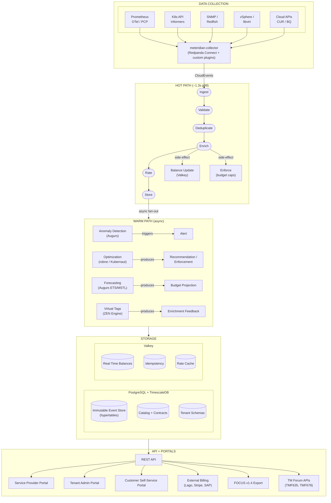
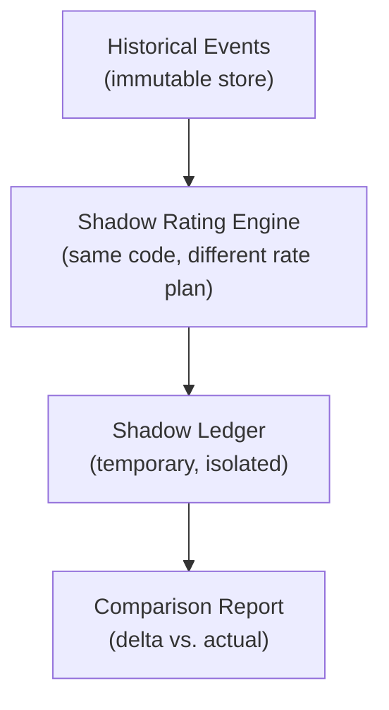
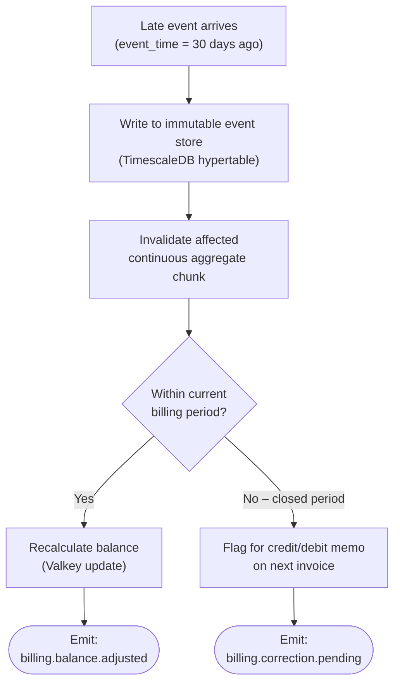
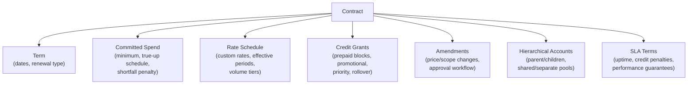
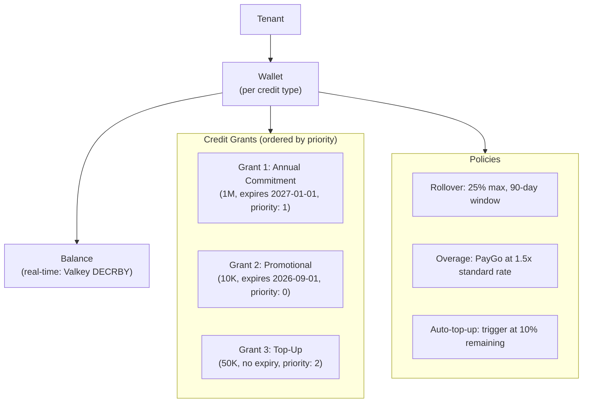
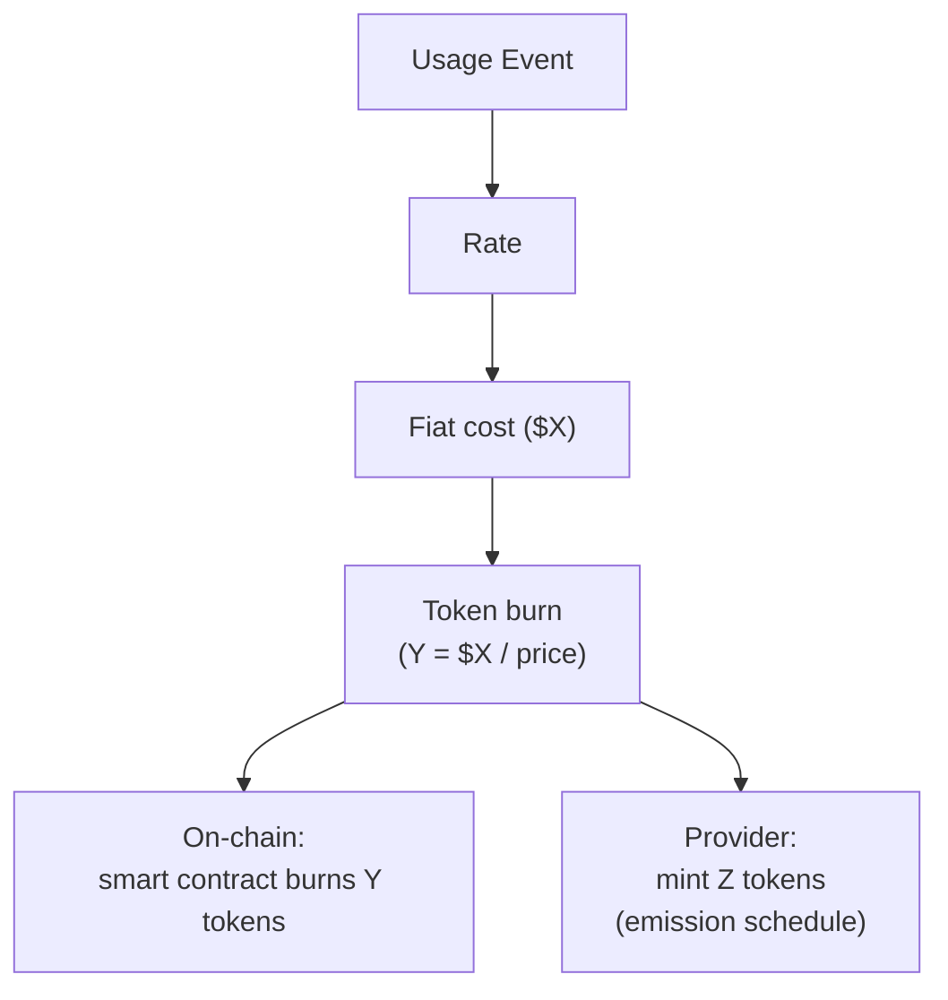

# METR-0001: Meteridian Platform Architecture

- **Status:** provisional
- **Authors:** @pgarciaq
- **Created:** 2026-06-18
- **Last Updated:** 2026-06-25

## Summary

Meteridian is a billing-grade metering, rating, and cost management platform for
hybrid infrastructure. It covers the full spectrum: Kubernetes, bare metal,
hypervisors, cloud providers (AWS, Azure, GCP), network devices, mainframes,
OpenStack, and AI/ML workloads. It provides telco-grade rating accuracy with
real-time balance management, deploys on-premises or in the cloud, and is fully
open source under Apache 2.0.

The name "Meteridian" is a portmanteau of "metering" and "meridian" -- a
measurement line and standard.

## Motivation

### Problems with the Current State (Koku)

1. **Limited infrastructure coverage** -- Only Kubernetes (OCP), AWS, Azure, GCP.
   No bare metal, hypervisors, network devices, mainframes, or OpenStack.
2. **Post-hoc accounting only** -- Costs are calculated after the fact. No
   real-time balance management, prepaid credits, or consumption enforcement.
3. **Cloud-first architecture** -- Depends on Trino/Hive for heavy aggregation.
   On-prem is a secondary path.
4. **No billing-grade accuracy** -- Eventual consistency; no exactly-once
   processing guarantees.
5. **No tokenomics** -- No credit abstraction, prepaid wallets, pooling,
   rollover, or budget enforcement.
6. **No optimization integration** -- Cost data is passive; no connection to
   rightsizing or AIOps engines.

### Goals

- Meter ANY infrastructure (not just cloud-native)
- Billing-grade accuracy (exactly-once, sub-minute latency)
- Real-time balance management with consumption enforcement
- On-premises first, cloud-ready
- Telco-grade rating (tiered, time-of-day, bundles, commitments, prepaid)
- Full tokenomics engine (credits, wallets, pooling, capacity tokenization)
- Optimization integration (robne, Kubernaut)
- Open source (Apache 2.0), no vendor lock-in

### Non-Goals

- OCI support (deprecated/removed)
- Replacing invoice generation (delegate to Lago/Stripe)
- Building a full ERP system
- Blockchain-native architecture (capacity tokenization is a pluggable block, not a core dependency)

## Architecture Overview



## 1. Data Collection Architecture

### Framework: Redpanda Connect (Apache 2.0)

Use Redpanda Connect (formerly Benthos) as the collector framework -- the same
approach OpenMeter uses. This gives 200+ data source connectors for free. Custom
plugins are built ONLY for infrastructure sources that Redpanda Connect doesn't
support natively.

### Built-in Sources (via Redpanda Connect)

| Category | Sources |
|----------|---------|
| **Cloud** | AWS (SQS, SNS, S3, Kinesis), GCP (Pub/Sub, Cloud Storage, BigQuery), Azure (Event Hubs, Blob, Queue) |
| **Messaging** | Kafka, AMQP, MQTT, NATS, Redis Streams, RabbitMQ |
| **Databases** | PostgreSQL, MySQL, MongoDB, ClickHouse |
| **Observability** | Prometheus, OpenTelemetry, StatsD |
| **Kubernetes** | Pod lifecycle events, resource usage |
| **HTTP** | Webhooks, REST APIs, WebSockets |
| **Files** | S3, SFTP, local filesystem |
| **AI/LLM** | LangChain, NVIDIA Run:ai |

### Custom Plugins (~10)

| Plugin | Source | Rationale |
|--------|--------|-----------|
| `snmp` | SNMP-enabled network devices | Infrastructure-specific |
| `redfish` | IPMI/Redfish BMC APIs (bare metal) | Hardware management protocol |
| `vsphere` | VMware vSphere/VCF API | Enterprise hypervisor |
| `libvirt` | KVM/QEMU via libvirt API | Open-source hypervisor |
| `nutanix` | Nutanix Prism Central API | Enterprise HCI |
| `hyperv` | Hyper-V via WMI/PowerShell | Windows hypervisor |
| `netflow` | NetFlow/sFlow/IPFIX collectors | Network traffic metering |
| `pcp` | Performance Co-Pilot | Red Hat performance monitoring |
| `mainframe` | CICS/IMS/zVM interfaces | Mainframe metering |
| `ocp-operator` | Evolved koku-metrics-operator | Emits CloudEvents instead of CSV tarballs |

### Deployment

The collector is deployed as:
- A Helm chart with presets (like OpenMeter)
- A standalone binary for non-Kubernetes environments
- An OCP operator (evolved from koku-metrics-operator)

All sources emit CloudEvents to the Meteridian ingestion API.

## 2. Performance Budget

### Target SLAs

- **30 seconds:** Resource consumption to metric sent (upstream of Meteridian)
- **60 seconds:** Metric received to billing-grade cost (Meteridian pipeline)

### Pipeline Latency Breakdown

| Stage | p99 Latency |
|-------|-------------|
| CloudEvents HTTP ingestion | < 100ms |
| Event bus publish + consume (NATS/Kafka) | < 500ms |
| Deduplication (Bloom filter / Valkey idempotency) | < 100ms |
| Enrichment (inventory lookup, cached in Valkey) | < 50ms |
| Rating (rate plan lookup + arithmetic) | < 200ms |
| Balance update (Valkey INCRBY atomic) | < 50ms |
| Store (async write to PostgreSQL) | < 200ms |
| **Total pipeline** | **~1.3s p99** |

At 1M events/sec: Horizontally partitioned by (tenant_id, resource_id). Each
partition handles ~10K events/sec. Latency stays constant.

### Hot Path vs. Warm Path

```
Hot Path (1.3s p99): Ingest -> Validate -> Enrich -> Rate -> Store
Warm Path (async):   Enrich -> fan-out -> Anomaly Detection -> Optimization Engine
                                         -> Alert if anomaly   -> Lifecycle event
```

Optimization/AI stages run on the warm path (async fan-out copy), NOT in the hot
path. If they produce lifecycle events (e.g., "resize VM"), those enter the hot
path as new events.

## 3. Storage and Deployment Profiles

### Core Principle

**PostgreSQL is the system of record for every profile.** Metering events, catalog
data, tenant schemas, and (in Micro) hot-path projections all land in PostgreSQL.
Optional components — Valkey, NATS/Kafka, TimescaleDB, ClickHouse — are added when
scale or latency requirements exceed what a single database can deliver alone.

The [Postgres Is Enough](https://postgresisenough.dev/) philosophy informs the
**Micro** profile: start with one PostgreSQL instance and one Go binary, prove value
on small clusters, then upgrade deliberately. This does **not** replace Valkey at
Standard and above; telco-grade rating at scale still depends on in-memory balance
management per [ADR-0002](../../docs/adr/0002-valkey-balance-management.md).

See [ADR-0011](../../docs/adr/0011-postgres-first-deployment-profiles.md) for the
formal decision, interface contracts, and upgrade triggers.

### Micro: PG-Only Mode

The **Micro** profile satisfies [FR-1102](../0000-requirements/requirements.md) and
[US-020](../0000-requirements/requirements.md): a single air-gapped RHEL server with
PostgreSQL and one Go binary — no Valkey, no Kafka, no NATS, no internet.

| Component | Micro implementation |
|-----------|---------------------|
| **Process model** | Single binary (ingest, validate, dedup, enrich, rate, store, API) |
| **Event store** | PostgreSQL with native range partitioning (monthly `usage_start`) |
| **Balances / idempotency** | PostgreSQL tables + advisory locks or `SELECT … FOR UPDATE` |
| **Enrichment cache** | In-process Go cache (ristretto), optional PG materialized views |
| **Event transport** | In-process channels (no external bus) |
| **Target scale** | ≤ 5K events/sec, single replica, ≤ 50-node clusters |

Micro trades sub-millisecond balance latency for operational simplicity. Balance
queries may exceed [FR-302](../0000-requirements/requirements.md) p99 targets under
concurrent load; that is acceptable until an upgrade trigger fires.

### Deployment Profile Matrix

| Profile | Event store | Config / billing | Balances | Idempotency | Event transport | OLAP read path |
|---------|-------------|------------------|----------|-------------|-----------------|----------------|
| **Micro** | PostgreSQL (partitioned) | Same instance | PostgreSQL (`BalanceStore`) | PostgreSQL (`IdempotencyStore`) | In-process (`EventTransport`) | PostgreSQL |
| **Small** | PostgreSQL + TimescaleDB | Same instance | Valkey | Valkey or PostgreSQL | Optional NATS | PostgreSQL + continuous aggregates |
| **Standard** | PostgreSQL + TimescaleDB | PostgreSQL (CNPG HA) | Valkey | Valkey | NATS or Kafka | PostgreSQL + continuous aggregates |
| **Enterprise** | PostgreSQL + TimescaleDB | PostgreSQL (CNPG multi-AZ) | Valkey cluster | Valkey cluster | NATS or Kafka | ClickHouse (optional accelerator) |
| **Hyperscale** | Citus (shard by `tenant_id`) | PostgreSQL | Valkey cluster | Valkey cluster | NATS or Kafka | ClickHouse (optional) |

**Operational footprint by profile:**

| Profile | Mandatory services | Typical optional add-ons |
|---------|---------------------|--------------------------|
| **Micro** | PostgreSQL + Go binary | — |
| **Small+** | PostgreSQL (+ TimescaleDB from Small) + Valkey | NATS, object storage for backups |
| **Standard+** | Above + event bus + CNPG HA | Prometheus, Lago connector |
| **Enterprise** | Above + Valkey cluster | ClickHouse for OLAP dashboards |

### Pluggable Backend Interfaces

Hot-path storage and messaging are **interface-driven**, not hard-coded. The rating
pipeline depends on three contracts; each profile selects a concrete implementation
via configuration (Helm values or single-binary flags):

```go
// BalanceStore — real-time wallet / budget enforcement
type BalanceStore interface {
    GetBalance(ctx context.Context, tenantID, walletID string) (decimal.Decimal, error)
    CheckAndDecrement(ctx context.Context, tenantID, walletID string, amount decimal.Decimal) (decimal.Decimal, error)
    SetBalance(ctx context.Context, tenantID, walletID string, amount decimal.Decimal) error
}

// IdempotencyStore — exactly-once event deduplication
type IdempotencyStore interface {
    Seen(ctx context.Context, idempotencyKey string) (bool, error)
    Mark(ctx context.Context, idempotencyKey string, ttl time.Duration) error
}

// EventTransport — decouple ingest from rating workers
type EventTransport interface {
    Publish(ctx context.Context, topic string, event cloudevents.Event) error
    Subscribe(ctx context.Context, topic string, handler func(cloudevents.Event) error) error
}
```

| Interface | Micro (PG) | Standard+ |
|-----------|------------|-----------|
| `BalanceStore` | PostgreSQL row locks + balance table; rebuild from event store on startup | Valkey Lua scripts ([ADR-0002](../../docs/adr/0002-valkey-balance-management.md)) |
| `IdempotencyStore` | PostgreSQL `idempotency_keys` table with TTL cleanup job | Valkey SET NX + TTL (or PostgreSQL fallback) |
| `EventTransport` | In-process buffered channel (single goroutine consumer) | NATS JetStream or Kafka ([ADR-0004](../../docs/adr/0004-cloudevents-event-format.md) envelope) |

PostgreSQL implementations are **correctness-first**; Valkey/NATS implementations
are **latency-first**. Both must produce identical rated events given the same input
stream — verified by conformance tests in the implementation repo.

### Upgrade Triggers

Add components when measured pain exceeds profile limits, not preemptively:

| Trigger | Symptom | Upgrade to | Rationale |
|---------|---------|------------|-----------|
| **Valkey** | Multi-replica rating deploys; wallet row lock contention on PostgreSQL; balance p99 > 50ms ([FR-302](../0000-requirements/requirements.md)); prepaid enforcement races under concurrent events | Valkey `BalanceStore` + `IdempotencyStore` | Sub-ms atomic check-and-decrement; removes PG hot-row bottleneck |
| **Event bus** | Ingest p99 > 500ms; sustained throughput > 10K events/sec; need ingest/rating decoupling for rolling upgrades | NATS JetStream or Kafka `EventTransport` | Buffer spikes; replay after failure; horizontal rating workers |
| **TimescaleDB** | Event table > 100M rows; rollup queries > 5s; compression desired on historical chunks | TimescaleDB extension on existing PG ([ADR-0001](../../docs/adr/0001-timescaledb-event-store.md)) | Hypertables, continuous aggregates, 10–20× compression — **Small+** default |
| **ClickHouse** | Enterprise OLAP dashboards; ad-hoc analytics over billions of rows; FinOps team needs sub-second aggregations across all tenants | ClickHouse read replica fed by PG logical replication or batch export | OLAP read accelerator only — PostgreSQL remains write path |
| **Citus** | Write TPS > 50K sustained; single PG node storage > 10TB | Citus sharding by `tenant_id` | Hyperscale horizontal write scaling |

Upgrades are **additive**: Micro → Small adds TimescaleDB + Valkey without
rewriting application logic — swap interface implementations and run migration jobs
to warm Valkey from PostgreSQL balance projections.

### Key Principles

- The system ALWAYS writes metering events to PostgreSQL (time-based partitioning)
- TimescaleDB continuous aggregates pre-compute rollups (hourly, daily, monthly) from **Small** upward
- ClickHouse is introduced ONLY as an optional read-path accelerator at **Enterprise**
- Micro uses PostgreSQL for all hot-path state; Valkey is the Standard+ default per ADR-0002

**Databases the team must support in production:** PostgreSQL (all profiles), Valkey
(Small through Hyperscale). ClickHouse and Citus are optional upgrade paths.

### TimescaleDB vs. Citus

| Aspect | TimescaleDB | Citus |
|--------|-------------|-------|
| **Problem** | Time-series queries slow on large tables | Single PG node can't handle write/storage load |
| **Mechanism** | Hypertables (auto time-partitioning) + compression + continuous aggregates | Sharding across PG nodes by distribution column (tenant_id) |
| **Best for** | Metering events (timestamped, time-range queries) | Multi-tenant distribution (>50K TPS, >10TB) |
| **Scaling** | Vertical (bigger machine) | Horizontal (more machines) |

TimescaleDB is the default for all profiles up to Enterprise. Citus is the
upgrade path for hyperscale deployments only.

### PostgreSQL HA: CloudNativePG

CloudNativePG (CNCF Sandbox) is the standard for PostgreSQL on Kubernetes.

| Aspect | CloudNativePG | Patroni + pgBouncer |
|--------|--------------|---------------------|
| **Failover** | 5-10 seconds | 20-45 seconds |
| **Dependencies** | None (K8s API for leader election) | DCS (etcd or K8s endpoints) |
| **Pooler** | Built-in Pooler CRD | Separate pgBouncer |
| **Backup** | Built-in Barman Cloud (S3/GCS) | WAL-G (separate config) |
| **K8s integration** | Native (custom pod controller) | Bolted on (StatefulSet + sidecar) |

CloudNativePG works with TimescaleDB via custom Docker images (production-proven)
or ImageVolume extensions (K8s 1.33+).

### RPO/RTO by Profile

| Profile | RPO | RTO | Mechanism |
|---------|-----|-----|-----------|
| **Micro** | ~5 min | < 30 min | Single PG, pg_dump backup |
| **Small** | < 1 min | < 15 min | CloudNativePG (2 instances) |
| **Standard** | 0 | < 5 min | CloudNativePG (3 instances, synchronous) |
| **Enterprise** | 0 | < 1 min | CloudNativePG (3+, multi-AZ), Valkey cluster |

Safety net: from **Small** upward, the event bus (NATS/Kafka) allows replay of
unprocessed events after recovery. **Micro** replays from PostgreSQL ingest log /
unprocessed event queue tables.

## 4. Metering Dimensions

### What Koku Covers Today (~15 dimensions)

| Category | Dimensions |
|----------|------------|
| **Compute (OCP)** | CPU request/usage/limit hours, Memory request/usage/limit GB-hours |
| **Storage (OCP)** | PVC request/usage/capacity GB-months |
| **GPU (OCP)** | GPU request/usage hours |
| **Node capacity** | Node CPU cores, memory |
| **Cloud costs** | AWS CUR, Azure exports, GCP BigQuery (passthrough) |
| **VM (KubeVirt)** | VM CPU/memory hours |

### What Meteridian Adds

| Category | Dimensions |
|----------|------------|
| **Network** | Egress/ingress bytes, packets/sec, bandwidth utilization, inter-zone/cross-region traffic, NAT gateway throughput |
| **IP addressing** | IPv4 addresses (allocated, in-use, elastic), IPv6 prefixes, floating IPs |
| **Storage (advanced)** | IOPS (read/write), throughput MB/s, tiers (hot/warm/cold/archive), snapshot capacity, replication factor |
| **Software/Licensing** | vCPU-hours for licensed software, named/concurrent user seats, per-core licensing (Oracle, SQL Server) |
| **AI/ML** | Token consumption (input/output), GPU-hours by model type, inference requests, training job hours, MIG slice hours, AI agent BOM |
| **Energy/Sustainability** | kWh consumed, PUE-adjusted kWh, carbon emissions (kg CO2e), cooling overhead |
| **Time/Event** | API calls, function invocations, message queue depth, DNS queries, load balancer connections |
| **Compliance/Governance** | Data classification storage (PII GB-hours), audit log volume, encryption key operations |
| **Bare metal** | Provisioned capacity (CPU cores, RAM GB, disk TB), power draw, rack units |
| **Mainframes** | MIPS, MSU, LPAR cores, IFL hours, zVM guest hours |
| **Network devices** | Switch port utilization, router throughput, VLAN membership, firewall rule evaluations |

## 5. Virtual Tags

Virtual tags are computed labels derived from rules, evaluated at enrichment time.

### Rule Definition

Rules are defined using JSON Decision Model (JDM) via GoRules -- users build
rules visually, not by writing code.

```yaml
kind: VirtualTagRule
spec:
  tagKey: "environment_tier"
  ruleType: "jdm"
  jdmContent: "<JDM JSON blob>"
  inputs:
    - source: kubernetes_labels
    - source: cloud_tags
    - source: inventory_attributes
    - source: other_virtual_tags     # chaining supported
  evaluateAt: enrichment
```

### Capabilities

- Virtual tags can chain (topological sort, cycle detection at definition time)
- Usable everywhere real tags are: filtering, grouping, rate plan selection,
  cost allocation, anomaly scoping, dashboards, API queries
- Generalizes Koku's cost categories into a universal rule engine

### UI: GoRules JDM Editor

| Component | Purpose | License |
|-----------|---------|---------|
| **JDM Editor** (`@gorules/jdm-editor`) | Visual rule editor React component | MIT |
| **ZEN Engine** (`gorules/zen`) | Rule evaluation engine (Rust, Go bindings) | MIT |

Users build rules in a spreadsheet-style decision table (no code). An optional
AI chatbot (Ollama, self-hosted) can generate JDM templates from natural language.

## 6. Hypervisor Support

| Phase | Hypervisors | Market Share | Discovery |
|-------|-------------|-------------|-----------|
| **Day 1** | KVM/libvirt (RHEV, OCP Virt, Proxmox), VMware vSphere/VCF | ~60% | libvirt API, K8s CRDs, VCF Operations API |
| **Phase 2** | Hyper-V, Nutanix AHV, Proxmox VE, oVirt, Harvester | ~35% | WMI/PowerShell, Prism Central, Proxmox API, oVirt REST, K8s CRDs |
| **Phase 3** | Xen/XCP-ng, Oracle VM, Scale Computing | ~5% | XAPI, Oracle VM Manager, SC//Platform REST |

## 7. OpenStack Support

Code to the OpenStack API contract (Nova, Cinder, Neutron, Keystone), not to
vendor-specific APIs.

| Vendor | Support |
|--------|---------|
| RHOSO (Red Hat OpenStack Services on OpenShift) | Day 1 |
| Mirantis MOSK | Yes (standard APIs) |
| Canonical OpenStack (Sunbeam/MicroStack) | Yes (standard APIs) |
| OpenStack-Helm | Yes (standard APIs) |
| Standalone (Kolla-Ansible, etc.) | Phase 2 |

## 8. Forecasting and Anomaly Detection

### Tiered Strategy

| Tier | Method | Implementation | When |
|------|--------|---------------|------|
| **Tier 1: Statistical** | ETS, MSTL, Prophet, Z-score, MAD, DBSCAN, changepoint | Augurs (Rust) via Go FFI/WASM | Day 1 |
| **Tier 2: Rule-based** | User-defined CEL expressions | Go (cel-go library) | Day 1 |
| **Tier 3: ML (optional)** | Merlion, Kats, foundation models (Moirai/TimeFM) | Python sidecar (gRPC) | Phase 2 |

Augurs (Rust, MIT/Apache-2.0) eliminates the Python sidecar for 90% of use
cases. It provides ETS, MSTL, Prophet, outlier detection, changepoint detection,
and clustering -- all in Rust with Go bindings.

## 9. Rate Plan Approval Workflow

### Engine: Fluxo (MIT, Embeddable Go Library)

| Option | Complexity | Dependencies | Use Case |
|--------|-----------|--------------|----------|
| **Fluxo** (chosen) | Low | PostgreSQL (already have it) | 1-10 workflows, durability, no external services |
| Custom FSM | Minimal | None | Only 1 trivial workflow |
| Hatchet | Medium | Separate service + PG | Many workflows, monitoring UI |
| Temporal | High | Temporal cluster + DB | Complex cross-service workflows |

Fluxo is an embeddable Go library with PostgreSQL persistence. Deterministic,
retryable, durable. <1ms overhead per step. MIT license.

```go
wf := fluxo.NewWorkflow("rate_plan_approval").
    Step("validate", validateRatePlan).
    Step("check_authz", checkOpenFGAPermission).
    Step("await_approval", awaitApprovalSignal).
    Step("activate", activateRatePlan).
    Step("notify", emitCloudEvent)
```

Upgrade path: Hatchet (MIT, Go-native) when workflow complexity grows.

## 10. Consumption Control Enforcement

| Environment | Mechanism | How |
|-------------|-----------|-----|
| **OpenShift AI** | Limitador (Kuadrant) | Token-based rate limiting via Envoy |
| **Kubernetes** | ResourceQuota + admission webhook | Meteridian calls K8s API to patch quotas |
| **API gateway** | Envoy ext_authz | Meteridian as ext_authz backend, check balance |
| **VM workloads** | Hypervisor API lifecycle events | Suspend/resize via libvirt/VMware/Nutanix |
| **Kubernaut** | Recommendation + enforcement loop | Budget constraints from Meteridian |

## 11. Telco vs. Cloud Billing

| Aspect | Cloud-Grade | Telco-Grade |
|--------|-------------|-------------|
| Accuracy | Eventual consistency; reconciliation | Exactly-once; no reconciliation needed |
| Latency | Minutes to hours | Real-time (< 60s) |
| Rating complexity | Simple (per-unit, per-hour) | Tiered, time-of-day, bundles, commitments |
| Balance management | Post-paid (monthly) | Pre-paid + post-paid (real-time) |
| Regulatory | SOC2, GDPR | SOC2, GDPR + telecom regulations |
| Dispute resolution | Self-service portal | Formal mediation process |

Meteridian targets telco-grade accuracy (exactly-once processing, sub-minute
rating, real-time balance) without requiring telecom-specific infrastructure.

## 12. Product Catalog

### Hierarchy

```
Catalog
  +-- Product Family (e.g., "OpenShift Compute", "AI Services")
       +-- Product (e.g., "OCP Pod Hours", "GPU Inference")
            +-- Plan (e.g., "Standard", "Enterprise", "Commitment-1yr")
                 +-- Price Component (metric, pricing model, constraints)
                 +-- Add-On (e.g., "Premium Support", "GPU Burst Pack")
                 +-- Entitlement (e.g., "Access to namespace X")
                 +-- Feature Flag (e.g., "anomaly_detection_enabled")
```

### Design Principles

- **Versioned and immutable** -- Changes create new versions; historical invoices
  reference the version active at billing time
- **Effective dating** -- Plans have `valid_from` / `valid_to` for scheduled changes
- **Inheritance** -- Child plans inherit parent defaults; override only differences
- **Multi-currency** -- Price components store amounts in multiple currencies with
  validity periods
- **Composable** -- Plans bundle multiple products; products appear in multiple plans
- **API-first** -- Full CRUD REST API; GitOps-friendly (YAML/JSON export/import)

## 13. Portal Architecture

### 13a. Service Provider Portal

For operators of the Meteridian platform (internal IT, MSP, sovereign cloud).

| Capability | Description |
|------------|-------------|
| Catalog management | Create/edit products, plans, pricing, add-ons |
| Tenant lifecycle | Onboard, suspend, decommission tenants |
| Rate plan administration | Create, version, approve, activate |
| Global dashboards | Cross-tenant revenue, usage trends, capacity |
| System health | Pipeline latency, throughput, queue depths |
| Compliance | Audit logs, data sovereignty map, GDPR requests |
| Collector management | Deploy/configure collectors, monitor connectivity |
| Integration config | External billing connections (Lago, Stripe, SAP) |

### 13b. Tenant Admin Portal

For FinOps leads and platform team leads within a customer organization.

| Capability | Description |
|------------|-------------|
| Cost allocation | Virtual tags, cost categories, showback rules |
| Budget management | Org/team/user budgets, alerts, enforcement |
| Credit management | Balances, top-ups, rollover policies |
| User management | BYOA integration, team hierarchies |
| Rate plan selection | Browse plans, request changes, view contracts |
| Report scheduling | Periodic cost reports (email, S3, webhook) |
| Optimization settings | robne/Kubernaut thresholds, approve recommendations |

### 13c. Customer Self-Service Portal

For end users consuming resources (developers, data scientists).

| Capability | Description |
|------------|-------------|
| Usage dashboard | Real-time personal/team consumption |
| Credit balance | Current balance, burn rate, depletion forecast |
| Cost breakdown | By project, namespace, resource type, period |
| Invoice history | Download invoices, dispute charges |
| Recommendations | Rightsizing from robne/Kubernaut |
| Resource catalog | Browse services, pricing, place orders |

### Technology

- React + PatternFly 6 (consistent with koku-ui heritage)
- Federated modules (each portal tier is independently deployable)
- Embeddable widgets (credit balance, usage sparkline) via Web Components
- Mobile-responsive (PWA for budget alerts)

## 14. Pricing Simulation

Run "what-if" scenarios on historical usage data with hypothetical rate plans.

### Use Cases

1. Price change impact analysis
2. Plan migration modeling
3. Discount negotiation (revenue impact)
4. New product launch projections
5. A/B testing rate plans

### Architecture



Simulation uses the SAME rating engine as production. Results stored in temporary
shadow tables (auto-expire). Supports batch (large date ranges) or interactive.

### API

```
POST /api/v1/simulations
{
  "name": "GPU price increase impact",
  "rate_plan_id": "draft-plan-uuid",
  "date_range": {"start": "2026-01-01", "end": "2026-03-31"},
  "scope": {"tenant_ids": ["*"]},
  "compare_to": "active"
}

GET /api/v1/simulations/{id}/results
{
  "summary": {"revenue_delta": "+12.4%", "affected_tenants": 47},
  "per_tenant": [{"tenant_id": "...", "current": 1200.00, "simulated": 1348.80}]
}
```

## 15. SQL-Based Metrics and Data Extracts

### SQL-Based Billable Metrics

Define billable metrics using SQL queries against the event store, enabling
arbitrarily complex metric definitions without code changes.

```sql
-- Example: "Distinct active containers per day"
SELECT
  date_trunc('day', event_time) AS period,
  tenant_id,
  COUNT(DISTINCT container_id) AS billable_quantity
FROM metering_events
WHERE event_type = 'container.active'
  AND event_time BETWEEN :start AND :end
GROUP BY 1, 2
```

Metrics are validated at creation time (EXPLAIN plan, syntax check). Executed by
TimescaleDB continuous aggregates (real-time) or batch jobs (complex queries).
Sandboxed (read-only, timeout, row limit).

### Data Extracts

| Type | Format | Delivery | Use Case |
|------|--------|----------|----------|
| Usage report | CSV, Parquet, JSON | S3/GCS, SFTP, webhook | Cost analysis |
| FOCUS export | FOCUS v1.4 (Parquet) | S3/GCS | FinOps tooling |
| Event replay | CloudEvents (JSON) | Kafka, S3 | Customer analytics |
| Invoice data | CSV, PDF | Email, S3 | Accounting |
| Audit log | JSON | S3, syslog | Compliance |

Scheduled (cron) or on-demand (API). Optional read-only SQL endpoint via
PgBouncer for direct query access (scoped to tenant schema).

## 16. Backdating and Late-Arriving Events

### Approach: Immutable Append-Only Event Store + Query-Time Rating

1. **All events are immutable.** Once written, never modified or deleted.
2. **Corrections are new events.** `correction_of: <original_id>`, type: void/amend/rerate.
3. **Billing computed at query time.** Rating engine replays all events for a period.
4. **Continuous aggregates handle 99%.** Late arrivals trigger incremental refresh.
5. **No fixed backdating window.** Events can arrive at any time.

### Correction Flow



Every correction creates a provenance chain (original -> correction -> ...).

## 17. Enterprise Contract Management

### Contract Structure



### Key Capabilities

| Capability | Description |
|------------|-------------|
| Committed spend tracking | Real-time progress; alerts at 50%, 75%, 90% |
| True-up calculation | Automatic shortfall at true-up dates |
| Ramp deals | Increasing commitment over term |
| Burndown visibility | Credit depletion forecast (Monte Carlo) |
| Amendment workflow | Fluxo-powered approval for all changes |
| Revenue recognition | ASC 606-compliant scheduling |
| Renewal management | 90/60/30-day alerts; auto-generate proposals |
| Multi-entity | Single contract spanning multiple legal entities |

## 18. Tokenomics Engine

### Three Dimensions

1. **Credit-Based Billing** -- Abstract consumption into credits; prepaid wallets
2. **Capacity Tokenization** -- Usage triggers token burns; providers receive minted tokens
3. **Internal Token Economy** -- Departments get token budgets; gamified chargeback

### Credit Wallet System



Lowest priority number burns first (promotional before paid).

### Conversion Rates

```yaml
credit_types:
  - name: "compute_credits"
    conversions:
      - metric: "cpu_core_hours"
        rate: 10          # 1 CPU-hour = 10 credits
      - metric: "gpu_hours_a100"
        rate: 500         # 1 A100-hour = 500 credits
      - metric: "memory_gb_hours"
        rate: 2           # 1 GB-hour = 2 credits
    version: 3
    effective_from: "2026-07-01"
```

Conversion rates are versioned with effective dates. Operators choose whether
infrastructure cost savings pass to customers or increase margin.

### Pooling and Hierarchical Budgets

```
Organization Pool (1M credits/month)
  +-- Team A Budget (400K) -- enforcement: hard block
  |     +-- User A1 (100K) -- enforcement: soft alert
  |     +-- User A2 (100K)
  +-- Team B Budget (300K) -- enforcement: throttle
  +-- Reserve (300K) -- overflow for any team
```

Enforcement policies per budget node: `alert`, `throttle`, `block`, `auto_upgrade`.

### Capacity Tokenization (Phase 3)

For decentralized infrastructure operators:



Chain-agnostic adapter interface (Ethereum, Cosmos, Solana, Substrate).
Smart contract templates for Burn-and-Mint Equilibrium.

### API Surface

```
POST   /api/v1/wallets                    # Create wallet
GET    /api/v1/wallets/{id}/balance       # Real-time balance (<50ms)
POST   /api/v1/wallets/{id}/grants        # Add credit grant
POST   /api/v1/wallets/{id}/topup         # Purchase credits
GET    /api/v1/wallets/{id}/transactions  # Ledger history
PUT    /api/v1/wallets/{id}/policies      # Set rollover/expiry/overage
POST   /api/v1/budgets                    # Create budget node
PUT    /api/v1/budgets/{id}/limits        # Set caps and enforcement
GET    /api/v1/budgets/{id}/utilization   # Current spend vs. budget
```

## 19. Comprehensive Market Requirements

### 19a. FinOps Standards

| Requirement | Priority | Implementation |
|-------------|----------|----------------|
| FOCUS v1.4 native export | Must-have | Built-in schema mapper; Parquet to S3/GCS |
| Unit economics | Must-have | Derived metrics: cost per transaction/user/feature |
| Budget guardrails (FinOps-as-Code) | Must-have | GitOps YAML policies; OPA evaluation |
| Anomaly detection with root cause | Must-have | Augurs + drill-down API |
| Commitment utilization tracking | Must-have | Real-time burn rate; waste alerts |
| Shared cost allocation (TBM) | Should-have | ATUM/TBM taxonomy mapping |

### 19b. Sovereign Cloud and Data Residency

| Requirement | Priority | Implementation |
|-------------|----------|----------------|
| Data residency enforcement | Must-have | OPA policy: jurisdiction tagging + routing rules |
| Gaia-X compliance labels | Should-have | Self-description API (JSON-LD) |
| Data provenance (UDLM) | Must-have | Every event carries provenance metadata |
| Sovereignty zones | Must-have | PG schema-per-jurisdiction OR row-level tagging |
| Right to erasure (GDPR Art. 17) | Must-have | Cryptographic erasure for immutable store |

### 19c. Security and Revenue Assurance

| Requirement | Priority | Implementation |
|-------------|----------|----------------|
| SOC 2 Type II (Processing Integrity) | Must-have | Idempotent processing, reconciliation, audit log |
| Fraud detection | Should-have | Anomaly detection on consumption (>10x spike) |
| Revenue leakage detection | Must-have | Reconcile metered vs. rated vs. invoiced |
| Immutable audit trail | Must-have | Append-only PG table with cryptographic chaining |
| Separation of duties | Must-have | 2-person approval (Fluxo + OpenFGA) |
| Tamper-evident billing | Should-have | Merkle tree over invoice line items |

### 19d. Telco BSS Features

| Requirement | Priority | Implementation |
|-------------|----------|----------------|
| Mediation engine | Must-have | CDR/EDR to CloudEvents; dedup; enrich; validate |
| Revenue sharing | Should-have | Multi-party settlement splits |
| Bill shock prevention | Must-have | Real-time alerts at N% of average |
| Dispute management | Must-have | Formal workflow (open/investigate/resolve) |
| Proration | Must-have | Proportional charges on mid-cycle changes |

### 19e. Enterprise Financial

| Requirement | Priority | Implementation |
|-------------|----------|----------------|
| Revenue recognition (ASC 606) | Should-have | Multi-element scheduling; deferred revenue |
| Multi-entity consolidation | Should-have | Cross-subsidiary aggregation |
| CPQ integration | Should-have | REST API for Salesforce CPQ, DealHub |
| Tax engine integration | Must-have | Avalara/TaxJar/Anrok REST |
| Credit notes and refunds | Must-have | Automated credit memo + refund workflow |

### 19f. GreenOps and Sustainability

| Requirement | Priority | Implementation |
|-------------|----------|----------------|
| Carbon metering | Should-have | kWh -> CO2e via WattTime/Electricity Maps |
| PUE-adjusted energy | Should-have | Data center PUE factor applied |
| Sustainability dashboards | Should-have | Carbon per namespace/team; trends |
| Carbon budgets | Nice-to-have | CO2 budgets alongside cost budgets |

### 19g. TM Forum Open APIs

| API | TMF ID | Purpose | Priority |
|-----|--------|---------|----------|
| Usage Management | TMF635 | Standard usage event format | Must-have |
| Customer Bill | TMF678 | Invoice format | Should-have |
| Account Management | TMF666 | Account hierarchy | Should-have |
| Product Catalog | TMF620 | Catalog structure | Should-have |

Implemented as optional API gateway translation layer (sidecar/adapter for
telco customers), not embedded in core.

## 20. Competitive Position

### Market Landscape

| Platform | Open Source | Self-Hosted | Focus |
|----------|-----------|-------------|-------|
| **OpenMeter** (Kong) | Apache 2.0 | Yes | AI/API metering |
| **Lago** | AGPLv3 | Yes | Usage-based billing |
| **Metronome** (Stripe) | No | No | Enterprise contracts |
| **Orb** | No | No | Developer-first billing |
| **Amberflo** | No | No | End-to-end metering |
| **Monetize360** | No | VPC | AI economy / NeoCloud |
| **Meteridian** | Apache 2.0 | Yes (primary) | Infrastructure + telco-grade |

### Unique Value (No Competitor Covers)

1. Infrastructure metering (bare metal, hypervisors, network, mainframes, OpenStack)
2. Telco-grade rating engine (time-of-day, bundles, commitments, prepaid)
3. Cost allocation with distribution (platform, worker, storage, network, GPU)
4. Optimization engine integration (robne, Kubernaut)
5. Virtual tags with visual rule builder
6. Tokenomics engine with capacity tokenization
7. On-premises first with sovereign cloud compliance

## 21. Reference Integrations

| Integration | Priority | Complexity |
|-------------|----------|------------|
| **Lago** (open-source billing) | 1st | Low (Docker Compose, REST API) |
| **Stripe Billing** | 2nd | Low (test mode, excellent docs) |
| **ServiceNow ITFM** | 3rd | Medium (free developer instances) |
| **SAP S/4HANA** (OData) | Community | High (requires SAP expertise) |

## 22. License Audit

All core dependencies use permissive licenses compatible with Apache 2.0.

| Component | License | Risk |
|-----------|---------|------|
| GoRules ZEN Engine | MIT | None |
| GoRules JDM Editor | MIT | None |
| Augurs (Grafana) | MIT OR Apache-2.0 | None |
| Fluxo | MIT | None |
| CloudNativePG | Apache 2.0 | None |
| Redpanda Connect OSS | Apache 2.0 | None |
| OpenFGA | Apache 2.0 | None |
| CEL-Go | Apache 2.0 | None |
| TimescaleDB | TSL + Apache 2.0 | Free to use; cannot redistribute as competing managed DB |
| Lago | AGPLv3 | REST API integration only; no code embedding |

## 23. UDLM Integration

UDLM (Universal Data Lifecycle Management) is a specification for infrastructure
lifecycle management. Meteridian adopts selected concepts:

**Adopted:**
- Resource type FQN taxonomy (`Compute.VirtualMachine`, `Storage.BlockVolume`)
- Field-level provenance model (origin, actor, timestamp, reason)
- Sovereignty zone concept (jurisdiction boundaries for data routing)

**Not applicable:**
- 4-state lifecycle (metering starts at Realized)
- Provider contract (our providers are data sources)
- Event envelope (we use CloudEvents)

If DCM (UDLM realization) is the provisioning layer, Meteridian subscribes to
lifecycle events (`entity.created`, `entity.decommissioned`) to trigger metering
start/stop.

---

## Open Questions

1. Should the product catalog support subscription management natively, or
   always delegate to Lago/Stripe?
2. What is the minimum DePIN integration that provides value without requiring
   full blockchain infrastructure?
3. Should TM Forum API compliance be a first-class feature or a community-contributed adapter?
4. How do we handle multi-region deployments with data sovereignty requirements
   while maintaining a single-pane view?

## References

- [FOCUS Specification v1.4](https://focus.finops.org/)
- [Redpanda Connect](https://docs.redpanda.com/redpanda-connect/)
- [CloudNativePG](https://cloudnative-pg.io/)
- [GoRules ZEN Engine](https://github.com/gorules/zen)
- [Augurs](https://github.com/grafana/augurs)
- [Fluxo](https://github.com/petrijr/fluxo)
- [OpenFGA](https://openfga.dev/)
- [TimescaleDB](https://www.timescale.com/)
- [TM Forum Open APIs](https://www.tmforum.org/open-apis/)
- [Gaia-X Trust Framework](https://docs.gaia-x.eu/)
