# METR-0003: Product and Service Catalog

- **Status:** provisional
- **Authors:** @pgarciaq, @jordigilh
- **Created:** 2026-06-18
- **Last Updated:** 2026-06-22
- **Depends on:** METR-0001 (Platform Architecture)
- **Related:** METR-0002 (Extensibility), METR-0004 (Credit, Prepaid, and Token Billing), METR-0005 (Internal Budget Units), METR-0006 (Developer Experience)

---

## Table of Contents

1. [Summary](#1-summary)
2. [Motivation](#2-motivation)
3. [Catalog Data Model](#3-catalog-data-model)
4. [Resource Type Registry](#4-resource-type-registry)
5. [SQL-Based Metric Definitions](#5-sql-based-metric-definitions)
6. [Composable Rate Plans](#6-composable-rate-plans)
7. [Effective Dating and Backdating](#7-effective-dating-and-backdating)
8. [Multi-Currency Price Books](#8-multi-currency-price-books)
9. [Credit and Token Products](#9-credit-and-token-products)
10. [Catalog API](#10-catalog-api)
11. [Integration with Block Runtime](#11-integration-with-block-runtime)
12. [External Catalog Integration (Bring Your Own Catalog)](#12-external-catalog-integration-bring-your-own-catalog)
13. [Probabilistic Pricing Simulation (Moat Deepening)](#13-probabilistic-pricing-simulation-moat-deepening)
14. [Open Questions](#14-open-questions)
15. [References](#15-references)

---

## 1. Summary

The **Product and Service Catalog** is Meteridian's system of record for all
billable products, services, plans, and pricing. It defines what customers can
subscribe to, how usage is measured, and what rates apply. Every invoice, credit
memo, revenue recognition entry, and usage alert traces back to catalog data.

The catalog follows a hierarchical model proven by enterprise billing platforms
(Zuora, Stripe Billing, Chargebee, Orb, lago):

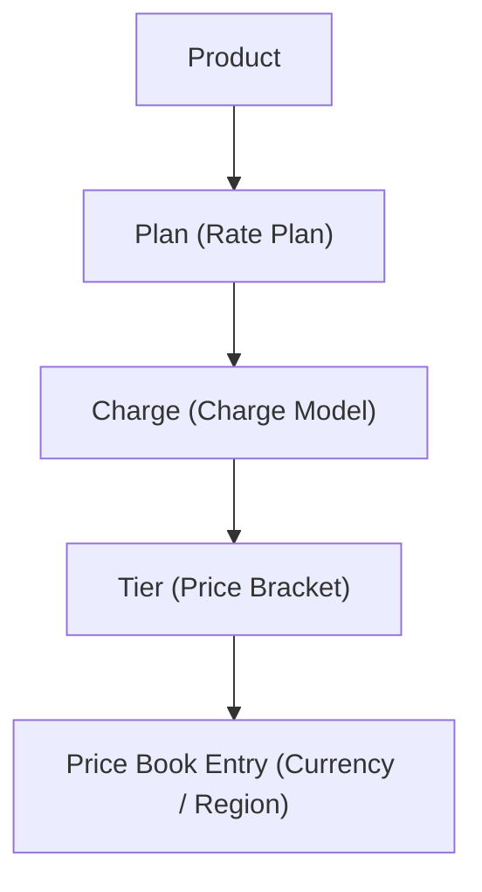

Beyond the hierarchy, Meteridian introduces two concepts not found in
competitors:

1. **Resource Type Registry** — a canonical registry of billable resource types
   (CPU core, GB of RAM, GPU hour, API call, etc.) with declared units,
   precision, aggregation methods, and provider-specific mappings. This provides
   a stable vocabulary that decouples pricing logic from raw event schemas.

2. **SQL-Based Metric Definitions** — billable metrics defined as versioned SQL
   queries against the event store (TimescaleDB, see ADR-0001). This allows
   platform operators to create, test, and deploy new billable metrics without
   code changes or redeployments.

The catalog is effective-dated, multi-currency, auditable, and API-first. It
integrates with the block runtime (METR-0002) for real-time rating and with the
event store for historical re-rating.

---

## 2. Motivation

### 2.1 The Problem

Without a well-designed catalog, billing platforms accumulate technical debt that
directly impacts revenue accuracy:

| Problem | Business impact |
|---------|----------------|
| Pricing changes require code deployments | Weeks-long release cycles for rate changes; pricing is locked to engineering sprints |
| Rate plan composition is hardcoded | Each customer contract requires custom code; no reuse across similar deals |
| Multi-currency support is ad-hoc | Currency conversion errors, inconsistent rounding, regulatory non-compliance |
| No audit trail for pricing changes | Revenue leakage undetectable; SOX/SOC2 audit findings |
| Late-arriving events rated at wrong price | Revenue mis-statement, customer disputes, manual invoice adjustments |
| No simulation capability | Pricing changes deployed blind; unexpected revenue impact discovered post-facto |

### 2.2 Competitor Landscape

Every major billing platform has a mature catalog, but each has notable
limitations:

| Platform | Catalog strengths | Catalog weaknesses |
|----------|------------------|--------------------|
| **Zuora** | Deep rate plan model, amendment history, multi-currency | Closed-source, expensive, complex API (~400 fields on Product object) |
| **Stripe Billing** | Simple Products + Prices API, excellent DX | No plan inheritance, limited tier types, no effective dating on prices |
| **Orb** | SQL-based metric definitions, plan composition | No multi-currency price books, no rate plan versioning |
| **Amberflo** | Real-time metering + rating | No plan hierarchy, pricing is flat key-value pairs |
| **lago** | Open-source, charge model flexibility | No plan inheritance, no effective dating, no price books |
| **OpenMeter** | CloudEvents-native metering | No catalog at all — metering only, pricing is external |

Meteridian's catalog takes the best ideas from each: Zuora's hierarchical model,
Orb's SQL-based metrics, Stripe's developer experience, and lago's open-source
transparency — and adds effective dating, plan inheritance, multi-currency price
books, and integration with the block runtime.

### 2.3 Design Principles

1. **Configuration over code.** Pricing changes must never require a code
   deployment. Rate plans, charges, tiers, and price books are data — managed
   through the API, stored in the database, versioned and auditable.

2. **Effective dating everywhere.** Every catalog entity has a validity window
   (`effective_start`, `effective_end`). Queries against the catalog always
   specify a point in time. There is no concept of "current" without a
   timestamp.

3. **Immutable history.** Catalog changes are append-only. Updating a charge
   creates a new version; the previous version remains queryable for historical
   rating and audit.

4. **Composability.** Plans are composed from reusable charges. Charges are
   composed from reusable tiers. Price books overlay currency-specific pricing.
   Enterprise deals compose base plans with negotiated overrides.

5. **Separation of metering and rating.** The catalog defines *what to bill and
   at what rate*. The event store (ADR-0001) defines *what happened*. The rating
   engine (a block in the pipeline, METR-0002) joins the two. The catalog never
   touches raw events directly.

---

## 3. Catalog Data Model

### 3.1 Entity Hierarchy

The catalog uses a five-level hierarchy. Each level has a well-defined
responsibility:

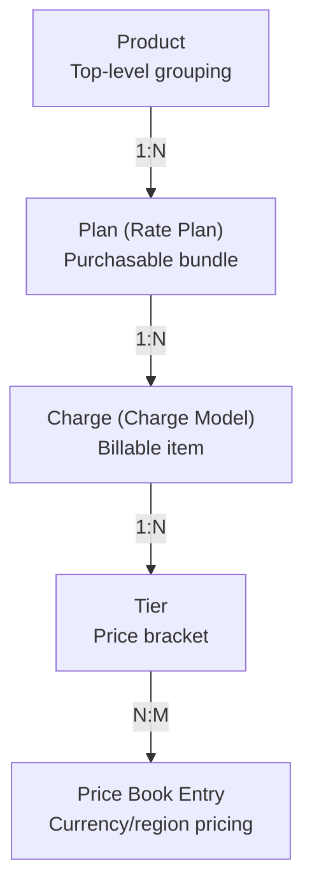

### 3.2 Product

A **Product** is the top-level organizational unit. It groups related plans and
provides a marketing-facing identity. Products have no pricing of their own —
pricing lives on charges within plans.

```sql
CREATE TABLE catalog.products (
    id              UUID PRIMARY KEY DEFAULT gen_random_uuid(),
    name            TEXT NOT NULL,
    slug            TEXT NOT NULL UNIQUE,
    description     TEXT,
    category        TEXT NOT NULL,          -- 'compute', 'storage', 'network', 'gpu', 'platform', 'custom'
    status          TEXT NOT NULL DEFAULT 'draft',  -- 'draft', 'active', 'deprecated', 'retired'
    metadata        JSONB DEFAULT '{}',
    created_at      TIMESTAMPTZ NOT NULL DEFAULT now(),
    updated_at      TIMESTAMPTZ NOT NULL DEFAULT now(),
    created_by      UUID NOT NULL REFERENCES iam.users(id),
    CONSTRAINT valid_status CHECK (status IN ('draft', 'active', 'deprecated', 'retired'))
);
```

Example products:

| slug | name | category |
|------|------|----------|
| `compute` | Compute Services | compute |
| `object-storage` | Object Storage | storage |
| `gpu-inference` | GPU Inference | gpu |
| `api-gateway` | API Gateway | platform |

### 3.3 Plan (Rate Plan)

A **Plan** is a purchasable bundle of charges associated with a product. Plans
are what customers subscribe to. They can be standard (available to all),
custom (created for a specific tenant), or negotiated (enterprise deals with
overrides).

```sql
CREATE TABLE catalog.plans (
    id              UUID PRIMARY KEY DEFAULT gen_random_uuid(),
    product_id      UUID NOT NULL REFERENCES catalog.products(id),
    parent_plan_id  UUID REFERENCES catalog.plans(id),  -- for plan inheritance
    name            TEXT NOT NULL,
    slug            TEXT NOT NULL,
    description     TEXT,
    plan_type       TEXT NOT NULL DEFAULT 'standard',    -- 'standard', 'custom', 'negotiated'
    version         INT NOT NULL DEFAULT 1,
    status          TEXT NOT NULL DEFAULT 'draft',
    billing_period  TEXT NOT NULL DEFAULT 'monthly',     -- 'monthly', 'quarterly', 'annual', 'custom'
    trial_days      INT DEFAULT 0,
    effective_start TIMESTAMPTZ NOT NULL,
    effective_end   TIMESTAMPTZ,                         -- NULL = no end date
    metadata        JSONB DEFAULT '{}',
    created_at      TIMESTAMPTZ NOT NULL DEFAULT now(),
    updated_at      TIMESTAMPTZ NOT NULL DEFAULT now(),
    created_by      UUID NOT NULL REFERENCES iam.users(id),

    CONSTRAINT unique_plan_version UNIQUE (product_id, slug, version),
    CONSTRAINT valid_plan_type CHECK (plan_type IN ('standard', 'custom', 'negotiated')),
    CONSTRAINT valid_billing_period CHECK (billing_period IN ('monthly', 'quarterly', 'annual', 'custom'))
);
```

**Plan inheritance** enables enterprise deals without duplicating the entire
plan structure. A child plan inherits all charges from its parent and can
override specific charges or add new ones:

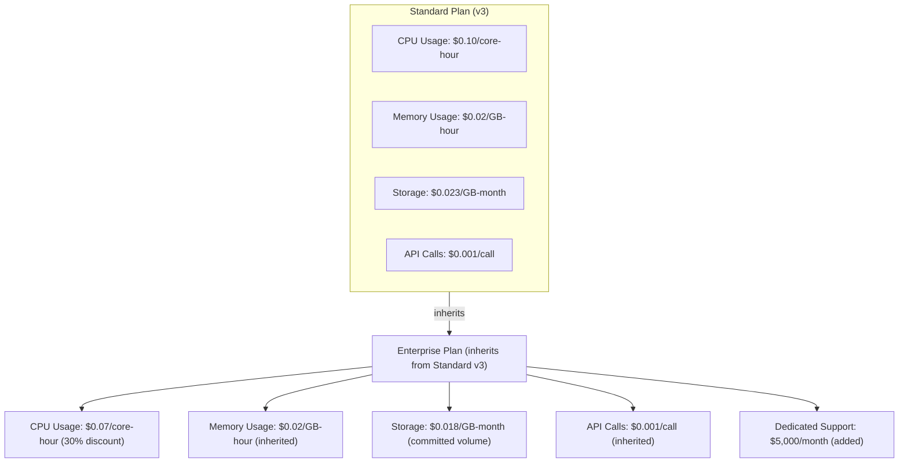

### 3.4 Charge (Charge Model)

A **Charge** is an individual billable item within a plan. Each charge specifies
a charge model that determines how quantity maps to price.

```sql
CREATE TABLE catalog.charges (
    id              UUID PRIMARY KEY DEFAULT gen_random_uuid(),
    plan_id         UUID NOT NULL REFERENCES catalog.plans(id),
    resource_type_id UUID REFERENCES catalog.resource_types(id),
    name            TEXT NOT NULL,
    slug            TEXT NOT NULL,
    description     TEXT,
    charge_model    TEXT NOT NULL,
    billing_cadence TEXT NOT NULL DEFAULT 'in_arrears',  -- 'in_advance', 'in_arrears'
    proration       BOOLEAN NOT NULL DEFAULT true,
    min_quantity    NUMERIC,
    max_quantity    NUMERIC,
    included_units  NUMERIC DEFAULT 0,                   -- free units before charging
    overage_model   TEXT,                                 -- how to handle usage above max_quantity
    is_optional     BOOLEAN NOT NULL DEFAULT false,       -- add-on charge
    metadata        JSONB DEFAULT '{}',
    effective_start TIMESTAMPTZ NOT NULL,
    effective_end   TIMESTAMPTZ,
    created_at      TIMESTAMPTZ NOT NULL DEFAULT now(),
    updated_at      TIMESTAMPTZ NOT NULL DEFAULT now(),

    CONSTRAINT valid_charge_model CHECK (charge_model IN (
        'flat',           -- fixed amount per period
        'per_unit',       -- price * quantity
        'tiered',         -- graduated pricing: each tier has its own rate
        'volume',         -- volume pricing: total quantity determines single rate
        'staircase',      -- step pricing: quantity determines tier, flat fee per tier
        'percentage',     -- percentage of a monetary amount (e.g., transaction fees)
        'package',        -- price per N units (e.g., $10 per 1000 API calls)
        'usage_minimum'   -- max(actual_usage, committed_minimum) * rate
    ))
);
```

#### Charge Model Reference

| Model | Formula | Use case |
|-------|---------|----------|
| `flat` | Fixed fee per period | Platform fee, support plan |
| `per_unit` | `quantity × unit_price` | Simple usage (API calls, compute hours) |
| `tiered` | Each unit priced at its tier's rate | Graduated compute pricing |
| `volume` | All units priced at the tier determined by total volume | Volume discount (>1M calls = $0.0005/call for ALL calls) |
| `staircase` | Flat fee per tier bracket | Step-function pricing (0-100 users = $50, 100-500 = $200) |
| `percentage` | `monetary_amount × percentage` | Transaction fees, marketplace cuts |
| `package` | `ceil(quantity / package_size) × package_price` | Blocks of units (1000 SMS = $5) |
| `usage_minimum` | `max(actual, committed) × rate` | Committed usage with minimums |

### 3.5 Tier

**Tiers** define price brackets within tiered, volume, and staircase charges.

```sql
CREATE TABLE catalog.tiers (
    id              UUID PRIMARY KEY DEFAULT gen_random_uuid(),
    charge_id       UUID NOT NULL REFERENCES catalog.charges(id),
    lower_bound     NUMERIC NOT NULL,        -- inclusive
    upper_bound     NUMERIC,                 -- exclusive; NULL = unlimited
    unit_price      NUMERIC,                 -- for tiered/volume models
    flat_fee        NUMERIC,                 -- for staircase model or flat fee per tier
    percentage      NUMERIC,                 -- for percentage model
    package_size    NUMERIC,                 -- for package model
    ordinal         INT NOT NULL,            -- display and evaluation order
    created_at      TIMESTAMPTZ NOT NULL DEFAULT now(),

    CONSTRAINT valid_bounds CHECK (upper_bound IS NULL OR upper_bound > lower_bound),
    CONSTRAINT unique_tier_order UNIQUE (charge_id, ordinal)
);
```

Example: **Tiered pricing for CPU core-hours**

| Tier | Range | Unit price |
|------|-------|-----------|
| 1 | 0 – 100 hours | $0.10/hour |
| 2 | 100 – 1,000 hours | $0.08/hour |
| 3 | 1,000 – 10,000 hours | $0.05/hour |
| 4 | 10,000+ hours | $0.03/hour |

A customer using 1,500 core-hours pays:
- Tiered model: `(100 × $0.10) + (900 × $0.08) + (500 × $0.05)` = **$107.00**
- Volume model: `1,500 × $0.05` = **$75.00** (all units at the tier-3 rate)

### 3.6 Price Book

A **Price Book** provides currency- and region-specific pricing for charges and
tiers. The default price book contains USD pricing; additional price books
provide localized pricing.

```sql
CREATE TABLE catalog.price_books (
    id              UUID PRIMARY KEY DEFAULT gen_random_uuid(),
    name            TEXT NOT NULL,
    slug            TEXT NOT NULL UNIQUE,
    currency        TEXT NOT NULL,            -- ISO 4217: 'USD', 'EUR', 'GBP', 'JPY'
    region          TEXT,                     -- optional: 'us-east', 'eu-west', 'ap-southeast'
    is_default      BOOLEAN NOT NULL DEFAULT false,
    effective_start TIMESTAMPTZ NOT NULL,
    effective_end   TIMESTAMPTZ,
    created_at      TIMESTAMPTZ NOT NULL DEFAULT now(),
    updated_at      TIMESTAMPTZ NOT NULL DEFAULT now()
);

CREATE TABLE catalog.price_book_entries (
    id              UUID PRIMARY KEY DEFAULT gen_random_uuid(),
    price_book_id   UUID NOT NULL REFERENCES catalog.price_books(id),
    charge_id       UUID REFERENCES catalog.charges(id),
    tier_id         UUID REFERENCES catalog.tiers(id),
    unit_price      NUMERIC,
    flat_fee        NUMERIC,
    percentage      NUMERIC,
    currency        TEXT NOT NULL,
    created_at      TIMESTAMPTZ NOT NULL DEFAULT now(),

    CONSTRAINT has_target CHECK (charge_id IS NOT NULL OR tier_id IS NOT NULL),
    CONSTRAINT unique_entry UNIQUE (price_book_id, charge_id, tier_id)
);
```

### 3.7 Entity Relationship Diagram

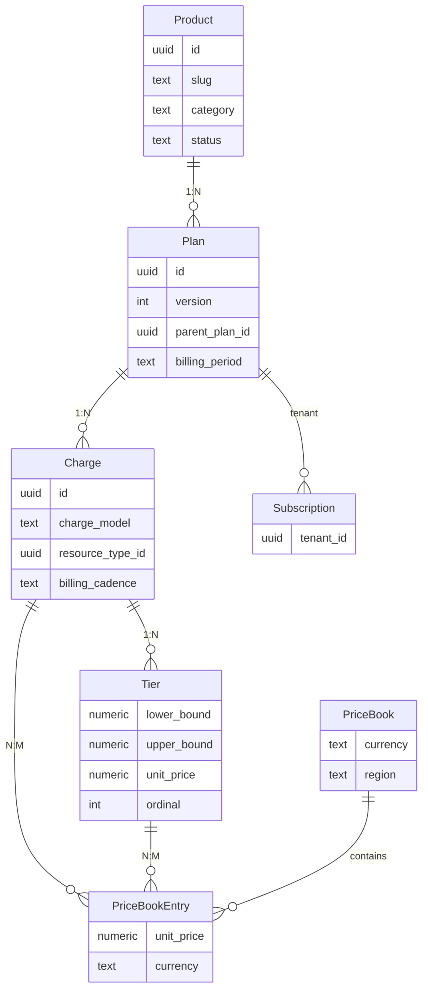

---

## 4. Resource Type Registry

### 4.1 Purpose

The Resource Type Registry is a Meteridian-specific concept that provides a
canonical vocabulary of billable resources. It decouples the catalog's pricing
model from the raw event schemas produced by different cloud providers and
infrastructure systems.

Without a registry, charges reference resource types by ad-hoc strings
(`"cpu_hours"`, `"CPU Hours"`, `"cpu-core-hours"`, `"compute_hours"`), leading
to inconsistency and broken joins between events and pricing.

### 4.2 Schema

```sql
CREATE TABLE catalog.resource_types (
    id                  UUID PRIMARY KEY DEFAULT gen_random_uuid(),
    name                TEXT NOT NULL UNIQUE,         -- 'cpu_core_hours', 'memory_gb_hours', 'gpu_hours'
    display_name        TEXT NOT NULL,                -- 'CPU Core-Hours'
    description         TEXT,
    unit_of_measure     TEXT NOT NULL,                -- 'core-hours', 'GB-hours', 'GB-months', 'calls', 'units'
    unit_symbol         TEXT,                         -- 'core·h', 'GB·h', 'GB·mo', 'req'
    precision           INT NOT NULL DEFAULT 6,       -- decimal places for quantity
    aggregation_method  TEXT NOT NULL DEFAULT 'sum',  -- 'sum', 'max', 'avg', 'count', 'distinct_count', 'last'
    default_granularity TEXT NOT NULL DEFAULT 'hourly', -- 'minutely', 'hourly', 'daily', 'monthly'
    is_currency_amount  BOOLEAN NOT NULL DEFAULT false, -- true for percentage-based charges on monetary amounts
    metadata            JSONB DEFAULT '{}',
    created_at          TIMESTAMPTZ NOT NULL DEFAULT now(),
    updated_at          TIMESTAMPTZ NOT NULL DEFAULT now(),

    CONSTRAINT valid_aggregation CHECK (aggregation_method IN (
        'sum', 'max', 'avg', 'count', 'distinct_count', 'last'
    )),
    CONSTRAINT valid_granularity CHECK (default_granularity IN (
        'minutely', 'hourly', 'daily', 'monthly'
    ))
);
```

### 4.3 Provider Mappings

Each resource type can have provider-specific mappings that define how raw event
data from different sources maps to the canonical resource type:

```sql
CREATE TABLE catalog.resource_type_mappings (
    id              UUID PRIMARY KEY DEFAULT gen_random_uuid(),
    resource_type_id UUID NOT NULL REFERENCES catalog.resource_types(id),
    provider        TEXT NOT NULL,            -- 'aws', 'azure', 'gcp', 'ocp', 'custom'
    event_type      TEXT NOT NULL,            -- event_type in the event store
    quantity_expr   TEXT NOT NULL,            -- SQL expression to extract quantity from event payload
    filter_expr     TEXT,                     -- optional WHERE clause fragment
    metadata        JSONB DEFAULT '{}',
    created_at      TIMESTAMPTZ NOT NULL DEFAULT now(),

    CONSTRAINT unique_mapping UNIQUE (resource_type_id, provider, event_type)
);
```

### 4.4 Registry Seed Data

The platform ships with a default set of resource types covering common
infrastructure billing scenarios:

```sql
INSERT INTO catalog.resource_types (name, display_name, unit_of_measure, unit_symbol, aggregation_method, default_granularity) VALUES
    ('cpu_core_hours',       'CPU Core-Hours',       'core-hours',   'core·h',  'sum', 'hourly'),
    ('memory_gb_hours',      'Memory GB-Hours',      'GB-hours',     'GB·h',    'sum', 'hourly'),
    ('storage_gb_months',    'Storage GB-Months',    'GB-months',    'GB·mo',   'sum', 'daily'),
    ('gpu_hours',            'GPU Hours',            'GPU-hours',    'GPU·h',   'sum', 'hourly'),
    ('network_egress_gb',    'Network Egress',       'GB',           'GB',      'sum', 'hourly'),
    ('network_ingress_gb',   'Network Ingress',      'GB',           'GB',      'sum', 'hourly'),
    ('api_calls',            'API Calls',            'calls',        'req',     'count', 'hourly'),
    ('vm_hours',             'VM Hours',             'VM-hours',     'VM·h',    'sum', 'hourly'),
    ('pvc_gb_months',        'PVC GB-Months',        'GB-months',    'GB·mo',   'sum', 'daily'),
    ('data_processed_gb',    'Data Processed',       'GB',           'GB',      'sum', 'hourly'),
    ('active_users',         'Active Users',         'users',        'users',   'distinct_count', 'monthly'),
    ('transactions',         'Transactions',         'transactions', 'txn',     'count', 'daily'),
    ('container_instances',  'Container Instances',  'instances',    'inst',    'max', 'hourly'),
    ('bandwidth_mbps',       'Bandwidth',            'Mbps',         'Mbps',    'max', 'hourly');
```

### 4.5 Provider Mapping Example

Mapping `cpu_core_hours` across providers:

```sql
INSERT INTO catalog.resource_type_mappings (resource_type_id, provider, event_type, quantity_expr, filter_expr) VALUES
    -- OpenShift: pod CPU usage from operator reports
    ((SELECT id FROM catalog.resource_types WHERE name = 'cpu_core_hours'),
     'ocp', 'pod_usage',
     'pod_usage_cpu_core_hours',
     NULL),

    -- AWS: EC2 instance hours normalized to vCPU-hours
    ((SELECT id FROM catalog.resource_types WHERE name = 'cpu_core_hours'),
     'aws', 'ec2_usage',
     'usage_amount * vcpu_count',
     'product_code = ''AmazonEC2'''),

    -- GCP: Compute Engine core-hours
    ((SELECT id FROM catalog.resource_types WHERE name = 'cpu_core_hours'),
     'gcp', 'compute_usage',
     'usage_amount',
     'sku_description LIKE ''%Core%''');
```

---

## 5. SQL-Based Metric Definitions

### 5.1 Concept

Billable metrics bridge the gap between raw events in the event store and
charges in the catalog. Rather than hardcoding metric calculations in
application code, Meteridian allows metrics to be defined as versioned SQL
queries against TimescaleDB.

This approach has three benefits:

1. **No code deployments for new metrics.** A platform operator can define a new
   billable metric through the API, test it against historical data, and
   activate it — all without touching application code.

2. **Testability.** Metrics can be dry-run against historical event data to
   verify correctness before activation.

3. **Auditability.** Every metric definition is versioned. The exact SQL that
   computed a line item on an invoice is always recoverable.

### 5.2 Schema

```sql
CREATE TABLE catalog.metric_definitions (
    id              UUID PRIMARY KEY DEFAULT gen_random_uuid(),
    resource_type_id UUID NOT NULL REFERENCES catalog.resource_types(id),
    name            TEXT NOT NULL,
    slug            TEXT NOT NULL,
    description     TEXT,
    version         INT NOT NULL DEFAULT 1,
    status          TEXT NOT NULL DEFAULT 'draft',   -- 'draft', 'active', 'deprecated'
    sql_template    TEXT NOT NULL,                    -- parameterized SQL query
    parameters      JSONB NOT NULL DEFAULT '[]',     -- declared parameters with types
    output_columns  JSONB NOT NULL,                  -- expected output schema
    validation_sql  TEXT,                             -- optional: assertion query for data quality
    effective_start TIMESTAMPTZ NOT NULL,
    effective_end   TIMESTAMPTZ,
    created_at      TIMESTAMPTZ NOT NULL DEFAULT now(),
    created_by      UUID NOT NULL REFERENCES iam.users(id),

    CONSTRAINT unique_metric_version UNIQUE (slug, version),
    CONSTRAINT valid_status CHECK (status IN ('draft', 'active', 'deprecated'))
);
```

### 5.3 Metric Definition Examples

#### CPU Core-Hours by Tenant

```sql
-- metric: cpu_core_hours_by_tenant (v1)
-- parameters: start_time (timestamptz), end_time (timestamptz)
-- output: tenant_id (uuid), quantity (numeric)

SELECT
    tenant_id,
    SUM(
        EXTRACT(EPOCH FROM (
            LEAST(usage_end, :end_time) - GREATEST(usage_start, :start_time)
        )) / 3600.0 * cpu_cores
    ) AS quantity
FROM events.compute_usage
WHERE usage_start < :end_time
  AND usage_end > :start_time
  AND event_type = 'pod_usage'
GROUP BY tenant_id
HAVING SUM(
    EXTRACT(EPOCH FROM (
        LEAST(usage_end, :end_time) - GREATEST(usage_start, :start_time)
    )) / 3600.0 * cpu_cores
) > 0;
```

#### Storage GB-Months by Tenant and Storage Class

```sql
-- metric: storage_gb_months_by_class (v1)
-- parameters: start_time (timestamptz), end_time (timestamptz)
-- output: tenant_id (uuid), storage_class (text), quantity (numeric)

WITH daily_snapshots AS (
    SELECT
        tenant_id,
        storage_class,
        time_bucket('1 day', usage_start) AS day,
        AVG(capacity_gb) AS avg_gb
    FROM events.storage_usage
    WHERE usage_start >= :start_time
      AND usage_start < :end_time
    GROUP BY tenant_id, storage_class, time_bucket('1 day', usage_start)
)
SELECT
    tenant_id,
    storage_class,
    SUM(avg_gb / days_in_month(:start_time)) AS quantity
FROM daily_snapshots
GROUP BY tenant_id, storage_class;
```

#### API Call Count with Endpoint Breakdown

```sql
-- metric: api_calls_by_endpoint (v1)
-- parameters: start_time (timestamptz), end_time (timestamptz)
-- output: tenant_id (uuid), endpoint (text), quantity (numeric)

SELECT
    tenant_id,
    payload->>'endpoint' AS endpoint,
    COUNT(*) AS quantity
FROM events.api_events
WHERE event_time >= :start_time
  AND event_time < :end_time
  AND event_type = 'api_call'
GROUP BY tenant_id, payload->>'endpoint';
```

### 5.4 Metric Lifecycle

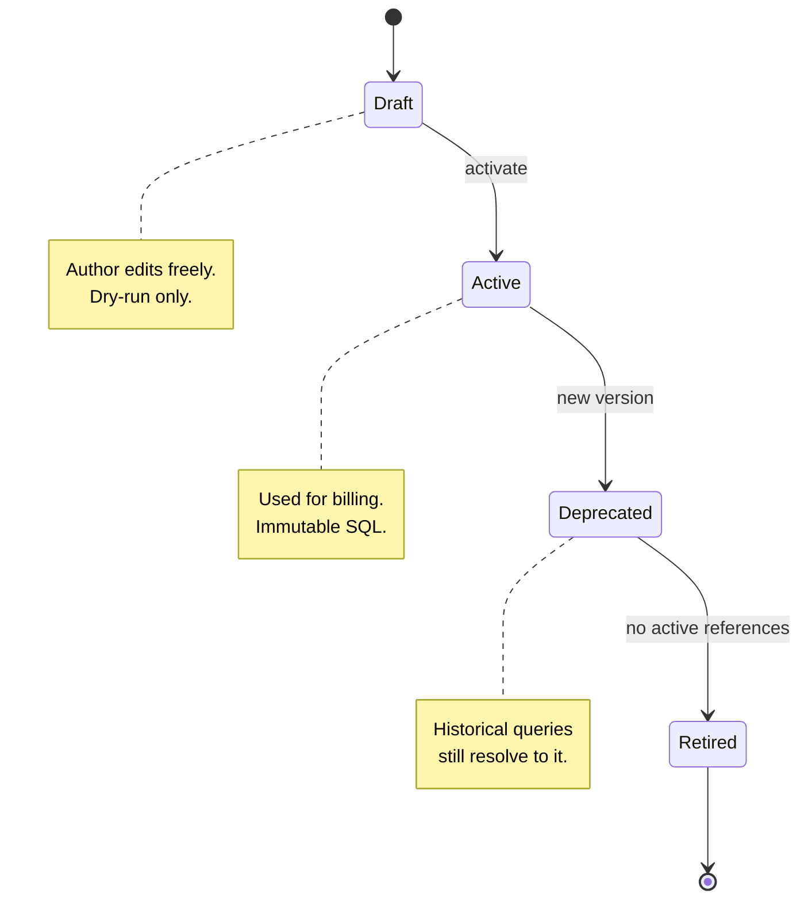

- **Draft** metrics can be edited freely and dry-run against historical data.
  They are never used for actual billing.
- **Active** metrics are used by the rating engine. Their SQL is immutable —
  any change requires creating a new version.
- **Deprecated** metrics have been superseded by a newer version. They remain
  queryable for historical invoice line items but are not used for new billing
  periods.
- **Retired** metrics are no longer referenced by any active charge. They exist
  only for audit purposes.

### 5.5 Dry-Run Endpoint

The API provides a dry-run endpoint to test a metric definition against
historical data without activating it:

```json
POST /api/v1/catalog/metrics/dry-run
{
  "sql_template": "SELECT tenant_id, SUM(cpu_core_hours) AS quantity FROM events.compute_usage WHERE usage_start >= :start_time AND usage_start < :end_time GROUP BY tenant_id",
  "parameters": {
    "start_time": "2026-06-01T00:00:00Z",
    "end_time": "2026-06-15T00:00:00Z"
  }
}

Response:
{
  "status": "success",
  "row_count": 47,
  "sample_rows": [
    { "tenant_id": "a1b2c3d4-...", "quantity": 1523.456789 },
    { "tenant_id": "e5f6g7h8-...", "quantity": 892.123456 }
  ],
  "execution_time_ms": 342,
  "warnings": []
}
```

### 5.6 Security

SQL-based metric definitions introduce SQL injection risk. The following
safeguards are enforced:

1. **Parameterized queries only.** The `sql_template` uses named bind parameters
   (`:param_name`). String interpolation is never performed.

2. **Read-only execution.** Metric queries run in a read-only PostgreSQL
   transaction (`SET TRANSACTION READ ONLY`).

3. **Schema restrictions.** Queries may only reference tables in the `events`
   schema. Access to `catalog`, `iam`, `billing`, and system schemas is denied
   via `SET search_path = events`.

4. **Statement timeout.** Metric queries have a configurable timeout (default:
   30 seconds). Queries exceeding the timeout are killed and the metric is
   flagged for review.

5. **Query plan review.** On activation, the query plan is captured and stored.
   Queries with sequential scans on large tables generate warnings.

---

## 6. Composable Rate Plans

### 6.1 Base + Add-On Composition

Plans can be composed modularly. A base plan provides core charges; optional
add-on charges extend the plan:

```json
{
  "plan": {
    "name": "Compute Pro",
    "slug": "compute-pro",
    "product_id": "prod_compute",
    "charges": [
      {
        "name": "CPU Usage",
        "slug": "cpu-usage",
        "charge_model": "tiered",
        "resource_type": "cpu_core_hours",
        "is_optional": false,
        "tiers": [
          { "lower_bound": 0, "upper_bound": 500, "unit_price": "0.10" },
          { "lower_bound": 500, "upper_bound": 5000, "unit_price": "0.07" },
          { "lower_bound": 5000, "upper_bound": null, "unit_price": "0.04" }
        ]
      },
      {
        "name": "Memory Usage",
        "slug": "memory-usage",
        "charge_model": "per_unit",
        "resource_type": "memory_gb_hours",
        "is_optional": false,
        "unit_price": "0.02"
      },
      {
        "name": "GPU Add-On",
        "slug": "gpu-addon",
        "charge_model": "per_unit",
        "resource_type": "gpu_hours",
        "is_optional": true,
        "unit_price": "2.50"
      },
      {
        "name": "Priority Support",
        "slug": "priority-support",
        "charge_model": "flat",
        "is_optional": true,
        "flat_fee": "500.00",
        "billing_cadence": "monthly"
      }
    ]
  }
}
```

### 6.2 Plan Inheritance

Child plans inherit all charges from a parent plan and can override specific
charges or add new ones. The inheritance chain can be multi-level (standard →
premium → enterprise) but is limited to a depth of 3 to prevent complexity.

Resolution order when evaluating charges for a subscription:

1. Child plan's own charges (overrides and additions)
2. Parent plan's charges (for any charge not overridden)
3. Grandparent plan's charges (if applicable)

Override matching is by charge `slug`. If a child plan defines a charge with
the same slug as the parent, the child's definition takes precedence.

```sql
-- Resolve effective charges for a plan, considering inheritance
WITH RECURSIVE plan_chain AS (
    SELECT id, parent_plan_id, 0 AS depth
    FROM catalog.plans
    WHERE id = :plan_id

    UNION ALL

    SELECT p.id, p.parent_plan_id, pc.depth + 1
    FROM catalog.plans p
    JOIN plan_chain pc ON p.id = pc.parent_plan_id
    WHERE pc.depth < 3
),
ranked_charges AS (
    SELECT
        c.*,
        pc.depth,
        ROW_NUMBER() OVER (PARTITION BY c.slug ORDER BY pc.depth ASC) AS rn
    FROM catalog.charges c
    JOIN plan_chain pc ON c.plan_id = pc.id
    WHERE c.effective_start <= :as_of
      AND (c.effective_end IS NULL OR c.effective_end > :as_of)
)
SELECT * FROM ranked_charges WHERE rn = 1;
```

### 6.3 Plan Versioning

Plans are versioned. When a plan is modified, a new version is created; the
previous version remains active for existing subscribers until they are migrated.

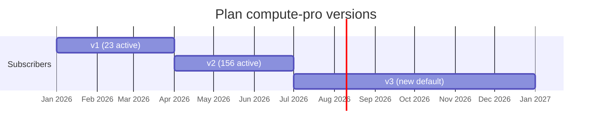

Version migration is explicit. The platform never silently moves a subscriber
to a new plan version. Migration can be:
- **Immediate:** subscriber is moved to the new version on the next billing
  cycle.
- **Scheduled:** migration happens on a specific date.
- **Opt-in:** subscriber is notified and must accept the new version.
- **Mandatory with notice:** subscriber is given N days notice before automatic
  migration (required in many jurisdictions for consumer billing).

### 6.4 Plan Templates (Charge Templates)

Frequently reused charge configurations can be saved as templates:

```sql
CREATE TABLE catalog.charge_templates (
    id              UUID PRIMARY KEY DEFAULT gen_random_uuid(),
    name            TEXT NOT NULL,
    slug            TEXT NOT NULL UNIQUE,
    description     TEXT,
    charge_model    TEXT NOT NULL,
    resource_type_id UUID REFERENCES catalog.resource_types(id),
    default_config  JSONB NOT NULL,  -- default tiers, unit_price, etc.
    created_at      TIMESTAMPTZ NOT NULL DEFAULT now()
);
```

A template can be instantiated into a plan with overrides:

```json
POST /api/v1/catalog/plans/compute-pro/charges
{
  "from_template": "standard-cpu-tiered",
  "overrides": {
    "tiers": [
      { "lower_bound": 0, "upper_bound": 1000, "unit_price": "0.08" },
      { "lower_bound": 1000, "upper_bound": null, "unit_price": "0.04" }
    ]
  }
}
```

---

## 7. Effective Dating and Backdating

### 7.1 Temporal Model

Every catalog entity (plan, charge, tier, price book entry) is effective-dated
using a validity window:

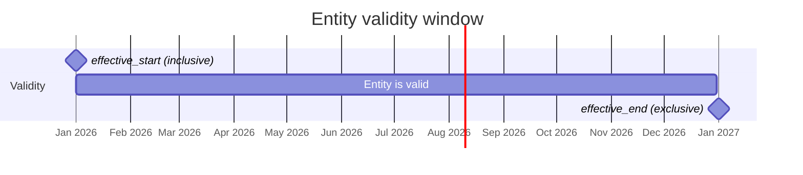

- `effective_start` is inclusive, `effective_end` is exclusive.
- `effective_end = NULL` means "valid indefinitely."
- Queries against the catalog always specify a point-in-time (`as_of`).
- There is no concept of "current" without a timestamp.

### 7.2 Point-in-Time Resolution

The rating engine resolves catalog entities at the timestamp of each usage
event, not at the time of invoice generation. This ensures that late-arriving
events are always rated using the correct price.

```sql
-- Resolve the charge applicable to a usage event
SELECT c.*
FROM catalog.charges c
WHERE c.plan_id = :plan_id
  AND c.slug = :charge_slug
  AND c.effective_start <= :event_timestamp
  AND (c.effective_end IS NULL OR c.effective_end > :event_timestamp);
```

### 7.3 Scheduling Future Changes

Rate plan changes can be scheduled in advance. A scheduled change creates a new
version of the affected entity with a future `effective_start`:

```json
POST /api/v1/catalog/charges/cpu-usage/schedule
{
  "effective_start": "2026-08-01T00:00:00Z",
  "changes": {
    "tiers": [
      { "lower_bound": 0, "upper_bound": 500, "unit_price": "0.09" },
      { "lower_bound": 500, "upper_bound": 5000, "unit_price": "0.06" },
      { "lower_bound": 5000, "upper_bound": null, "unit_price": "0.035" }
    ]
  }
}
```

The scheduling system:
- Validates that the change does not conflict with other scheduled changes.
- Stores the change as a new catalog entity version with future `effective_start`.
- Emits a `catalog.change_scheduled` event for notification workflows.
- On the effective date, no action is needed — the temporal query naturally
  resolves to the new version.

### 7.4 Late-Arriving Events

Late-arriving events (events with a timestamp in the past) are rated using the
rate plan that was active at the event's timestamp, not the current rate plan.
This is a critical correctness property.

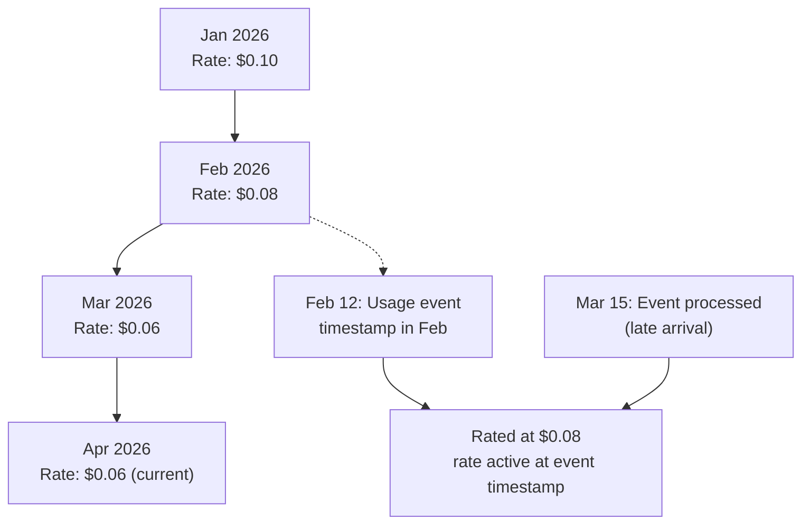

### 7.5 Audit Log

Every catalog change is recorded in an immutable audit log:

```sql
CREATE TABLE catalog.audit_log (
    id              BIGINT GENERATED ALWAYS AS IDENTITY PRIMARY KEY,
    entity_type     TEXT NOT NULL,         -- 'product', 'plan', 'charge', 'tier', 'price_book'
    entity_id       UUID NOT NULL,
    action          TEXT NOT NULL,         -- 'create', 'update', 'deprecate', 'retire'
    old_values      JSONB,                -- previous state (NULL for create)
    new_values      JSONB NOT NULL,       -- new state
    change_reason   TEXT,                 -- free-text justification
    changed_by      UUID NOT NULL REFERENCES iam.users(id),
    changed_at      TIMESTAMPTZ NOT NULL DEFAULT now(),
    effective_start TIMESTAMPTZ,          -- when the change takes effect
    correlation_id  UUID                  -- links related changes (e.g., bulk price update)
);
```

The audit log answers the four W questions for every pricing change:
- **Who** changed it (`changed_by`)
- **When** the change was made (`changed_at`)
- **What** changed (`old_values` → `new_values`)
- **Why** it was changed (`change_reason`)

### 7.6 What-If Simulation

Before applying a rate plan change, operators can simulate its impact on
historical billing data:

```json
POST /api/v1/catalog/simulate
{
  "charge_id": "chg_cpu_usage",
  "proposed_changes": {
    "tiers": [
      { "lower_bound": 0, "upper_bound": 500, "unit_price": "0.09" },
      { "lower_bound": 500, "upper_bound": null, "unit_price": "0.05" }
    ]
  },
  "simulation_period": {
    "start": "2026-05-01T00:00:00Z",
    "end": "2026-06-01T00:00:00Z"
  },
  "scope": "all_tenants"
}

Response:
{
  "summary": {
    "affected_tenants": 234,
    "current_revenue": "48291.34",
    "projected_revenue": "44107.82",
    "delta": "-4183.52",
    "delta_percent": "-8.66"
  },
  "distribution": {
    "decreased": 198,
    "unchanged": 12,
    "increased": 24
  },
  "top_impacted_tenants": [
    {
      "tenant_id": "t_acme_corp",
      "current": "12450.00",
      "projected": "10230.00",
      "delta": "-2220.00"
    }
  ]
}
```

---

## 8. Multi-Currency Price Books

### 8.1 Currency Architecture

Meteridian supports multi-currency billing through a price book model that
separates pricing from the core charge definition:

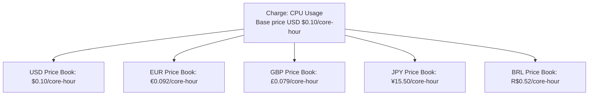

Each tenant has a **settlement currency** (the currency invoices are issued in)
and an optional **display currency** (the currency shown in the UI — can differ
from settlement for multinational organizations).

### 8.2 Exchange Rate Management

Exchange rates are managed through a dedicated table:

```sql
CREATE TABLE catalog.exchange_rates (
    id              UUID PRIMARY KEY DEFAULT gen_random_uuid(),
    from_currency   TEXT NOT NULL,
    to_currency     TEXT NOT NULL,
    rate            NUMERIC NOT NULL,
    rate_date       DATE NOT NULL,
    source          TEXT NOT NULL,          -- 'ecb', 'open_exchange_rates', 'manual', 'fixed'
    created_at      TIMESTAMPTZ NOT NULL DEFAULT now(),

    CONSTRAINT unique_rate UNIQUE (from_currency, to_currency, rate_date, source)
);
```

Three exchange rate strategies are supported:

| Strategy | Behavior | Use case |
|----------|----------|----------|
| **Fixed at price book** | Use the rate in the price book entry. Never convert. | Stable, predictable billing. Most common. |
| **Fixed at invoice** | Convert from base currency at the exchange rate on the invoice date. | Month-to-month rate adjustments. |
| **Daily rate** | Convert each event using the exchange rate on the event's date. | High-volume, high-frequency billing (fintech, trading platforms). |

The strategy is configured per price book:

```sql
ALTER TABLE catalog.price_books ADD COLUMN
    exchange_rate_strategy TEXT NOT NULL DEFAULT 'fixed_at_price_book'
    CONSTRAINT valid_fx_strategy CHECK (exchange_rate_strategy IN (
        'fixed_at_price_book', 'fixed_at_invoice', 'daily_rate'
    ));
```

### 8.3 Rounding Rules

Each currency has distinct rounding rules dictated by ISO 4217:

```sql
CREATE TABLE catalog.currency_config (
    currency        TEXT PRIMARY KEY,          -- ISO 4217 code
    decimal_places  INT NOT NULL,              -- 2 for USD/EUR, 0 for JPY, 3 for BHD
    rounding_mode   TEXT NOT NULL DEFAULT 'half_up',  -- 'half_up', 'half_even' (banker's), 'ceiling'
    symbol          TEXT NOT NULL,
    symbol_position TEXT NOT NULL DEFAULT 'prefix'     -- 'prefix' ($100) or 'suffix' (100€)
);

INSERT INTO catalog.currency_config VALUES
    ('USD', 2, 'half_up',   '$',  'prefix'),
    ('EUR', 2, 'half_even', '€',  'suffix'),
    ('GBP', 2, 'half_up',   '£',  'prefix'),
    ('JPY', 0, 'half_up',   '¥',  'prefix'),
    ('BHD', 3, 'half_up',   'BD', 'prefix'),
    ('BRL', 2, 'half_up',   'R$', 'prefix');
```

Rounding is applied:
- Per line item (never per event — aggregation before rounding).
- Using the currency's configured `rounding_mode`.
- After quantity × rate multiplication.
- The unrounded amount is stored alongside the rounded amount for audit.

---

## 9. Credit and Token Products

### 9.1 Pricing Models

Products in Meteridian can be priced in three currencies:

| Model | Description | Example |
|-------|-------------|---------|
| **Fiat** | Traditional monetary pricing | $0.10/core-hour |
| **Credits** | Prepaid platform balance drawdown | 10 credits/core-hour |
| **Tokens** | Blockchain/DePIN tokens (v2) | 0.001 MTR/core-hour |

### 9.2 Credit System

Credits are a platform-internal currency with a fixed exchange rate to the
tenant's settlement currency. They enable prepaid commitment models.

> **Note:** The canonical credit ledger schema is defined in
> [METR-0004 (Credit, Prepaid, and Token Billing)](../0004-credit-token-billing/credit-token-billing.md#33-credit-ledger).
> This section describes how the product catalog interacts with the credit
> system, not the ledger schema itself.

Credit drawdown follows a priority order:

1. **Expiring credits first** — credits closest to expiration are consumed first
   (FEFO: First Expiring, First Out).
2. **Oldest credits next** — among non-expiring credits, oldest are consumed
   first (FIFO).
3. **Overage** — when credits are exhausted, remaining usage is billed in the
   tenant's settlement currency at the overage rate.

### 9.3 Committed Spend Model

Enterprise contracts often include a committed spend (annual prepayment) with
overage billing:

```json
{
  "plan": {
    "name": "Enterprise Committed",
    "charges": [
      {
        "name": "Annual Compute Commitment",
        "charge_model": "flat",
        "flat_fee": "120000.00",
        "billing_cadence": "annual",
        "billing_timing": "in_advance",
        "credit_grant": {
          "amount": 1200000,
          "unit": "credits",
          "credit_to_fiat_rate": "0.10",
          "expires_months": 12
        }
      },
      {
        "name": "CPU Overage",
        "charge_model": "per_unit",
        "resource_type": "cpu_core_hours",
        "unit_price": "0.12",
        "applies_when": "credits_exhausted"
      }
    ]
  }
}
```

### 9.4 Token-Based Products (v2)

Token-based pricing is deferred to v2 and will be designed in a separate
enhancement (see ROADMAP.md). The catalog schema is designed to accommodate
tokens through the `pricing_unit` field on charges:

```sql
ALTER TABLE catalog.charges ADD COLUMN
    pricing_unit TEXT NOT NULL DEFAULT 'fiat'
    CONSTRAINT valid_pricing_unit CHECK (pricing_unit IN ('fiat', 'credits', 'tokens'));
```

---

## 10. Catalog API

### 10.1 API Design Principles

The Catalog API follows REST conventions with these constraints:

- **Versioned:** `/api/v1/catalog/...` — major version in the URL path.
- **JSON:API-style responses** with consistent envelope: `{ "data": ..., "meta": ... }`.
- **Pagination:** cursor-based (not offset-based) for large collections.
- **Filtering:** query parameters for common filters; RSQL for complex queries.
- **Idempotent writes:** `PUT` is idempotent; `POST` uses `Idempotency-Key` header.

### 10.2 Endpoints

#### Products

```
GET    /api/v1/catalog/products                    List products
POST   /api/v1/catalog/products                    Create a product
GET    /api/v1/catalog/products/{id}               Get a product
PUT    /api/v1/catalog/products/{id}               Update a product
DELETE /api/v1/catalog/products/{id}               Deprecate a product
```

#### Plans

```
GET    /api/v1/catalog/plans                       List plans (filterable by product, status, version)
POST   /api/v1/catalog/plans                       Create a plan
GET    /api/v1/catalog/plans/{id}                  Get a plan (with resolved charges if ?resolve=true)
PUT    /api/v1/catalog/plans/{id}                  Update a plan (creates new version)
POST   /api/v1/catalog/plans/{id}/versions         Create a new version explicitly
GET    /api/v1/catalog/plans/{id}/versions         List all versions of a plan
POST   /api/v1/catalog/plans/{id}/deprecate        Deprecate a plan version
```

#### Charges

```
GET    /api/v1/catalog/plans/{plan_id}/charges     List charges for a plan
POST   /api/v1/catalog/plans/{plan_id}/charges     Add a charge to a plan
GET    /api/v1/catalog/charges/{id}                Get a charge
PUT    /api/v1/catalog/charges/{id}                Update a charge
DELETE /api/v1/catalog/charges/{id}                Remove a charge from a plan
POST   /api/v1/catalog/charges/{id}/schedule       Schedule a future change
```

#### Tiers

```
GET    /api/v1/catalog/charges/{charge_id}/tiers   List tiers for a charge
PUT    /api/v1/catalog/charges/{charge_id}/tiers   Replace all tiers for a charge (atomic)
```

#### Price Books

```
GET    /api/v1/catalog/price-books                 List price books
POST   /api/v1/catalog/price-books                 Create a price book
GET    /api/v1/catalog/price-books/{id}            Get a price book with entries
PUT    /api/v1/catalog/price-books/{id}/entries     Upsert price book entries
```

#### Resource Types

```
GET    /api/v1/catalog/resource-types              List resource types
POST   /api/v1/catalog/resource-types              Register a new resource type
GET    /api/v1/catalog/resource-types/{id}         Get a resource type with provider mappings
```

#### Metrics

```
GET    /api/v1/catalog/metrics                     List metric definitions
POST   /api/v1/catalog/metrics                     Create a metric definition
GET    /api/v1/catalog/metrics/{id}                Get a metric definition
PUT    /api/v1/catalog/metrics/{id}                Update a draft metric
POST   /api/v1/catalog/metrics/{id}/activate       Activate a metric
POST   /api/v1/catalog/metrics/{id}/deprecate      Deprecate a metric
POST   /api/v1/catalog/metrics/dry-run             Dry-run a metric SQL against historical data
```

#### Simulation

```
POST   /api/v1/catalog/simulate                    Simulate impact of a rate change
```

#### Export / Import

```
POST   /api/v1/catalog/export                      Export full catalog as JSON
POST   /api/v1/catalog/import                      Import catalog from JSON (with conflict resolution)
```

### 10.3 API Payload Examples

#### Create a Product

```json
POST /api/v1/catalog/products
{
  "name": "Compute Services",
  "slug": "compute",
  "description": "CPU, memory, and container compute resources",
  "category": "compute"
}

Response: 201 Created
{
  "data": {
    "id": "prod_01J8X...",
    "name": "Compute Services",
    "slug": "compute",
    "description": "CPU, memory, and container compute resources",
    "category": "compute",
    "status": "draft",
    "created_at": "2026-06-18T14:30:00Z"
  }
}
```

#### Create a Plan with Charges

```json
POST /api/v1/catalog/plans
{
  "product_id": "prod_01J8X...",
  "name": "Compute Starter",
  "slug": "compute-starter",
  "billing_period": "monthly",
  "effective_start": "2026-07-01T00:00:00Z",
  "charges": [
    {
      "name": "Platform Fee",
      "slug": "platform-fee",
      "charge_model": "flat",
      "flat_fee": "49.99",
      "billing_cadence": "in_advance"
    },
    {
      "name": "CPU Usage",
      "slug": "cpu-usage",
      "charge_model": "tiered",
      "resource_type": "cpu_core_hours",
      "billing_cadence": "in_arrears",
      "included_units": 100,
      "tiers": [
        { "lower_bound": 0, "upper_bound": 1000, "unit_price": "0.10" },
        { "lower_bound": 1000, "upper_bound": 10000, "unit_price": "0.07" },
        { "lower_bound": 10000, "upper_bound": null, "unit_price": "0.04" }
      ]
    },
    {
      "name": "Memory Usage",
      "slug": "memory-usage",
      "charge_model": "per_unit",
      "resource_type": "memory_gb_hours",
      "unit_price": "0.015",
      "billing_cadence": "in_arrears"
    }
  ]
}

Response: 201 Created
{
  "data": {
    "id": "plan_01J9Y...",
    "product_id": "prod_01J8X...",
    "name": "Compute Starter",
    "slug": "compute-starter",
    "version": 1,
    "status": "draft",
    "billing_period": "monthly",
    "effective_start": "2026-07-01T00:00:00Z",
    "effective_end": null,
    "charges": [
      {
        "id": "chg_01J9Z...",
        "name": "Platform Fee",
        "slug": "platform-fee",
        "charge_model": "flat",
        "flat_fee": "49.99"
      },
      {
        "id": "chg_02K0A...",
        "name": "CPU Usage",
        "slug": "cpu-usage",
        "charge_model": "tiered",
        "resource_type": "cpu_core_hours",
        "included_units": 100,
        "tiers": [
          { "ordinal": 1, "lower_bound": "0", "upper_bound": "1000", "unit_price": "0.10" },
          { "ordinal": 2, "lower_bound": "1000", "upper_bound": "10000", "unit_price": "0.07" },
          { "ordinal": 3, "lower_bound": "10000", "upper_bound": null, "unit_price": "0.04" }
        ]
      },
      {
        "id": "chg_03L1B...",
        "name": "Memory Usage",
        "slug": "memory-usage",
        "charge_model": "per_unit",
        "resource_type": "memory_gb_hours",
        "unit_price": "0.015"
      }
    ],
    "created_at": "2026-06-18T14:35:00Z"
  }
}
```

#### Resolve Effective Charges at a Point in Time

```
GET /api/v1/catalog/plans/plan_01J9Y.../charges?as_of=2026-08-15T12:00:00Z&resolve=true

Response: 200 OK
{
  "data": [
    {
      "id": "chg_02K0A...",
      "name": "CPU Usage",
      "slug": "cpu-usage",
      "charge_model": "tiered",
      "source": "inherited",
      "source_plan": "compute-starter v1",
      "tiers": [ ... ]
    }
  ],
  "meta": {
    "as_of": "2026-08-15T12:00:00Z",
    "plan_version": 1,
    "inheritance_chain": ["compute-starter"]
  }
}
```

### 10.4 TMF620 Alignment

The Catalog API conforms to TM Forum TMF620 (Product Catalog Management API)
where applicable. Key alignments:

| TMF620 concept | Meteridian equivalent |
|----------------|----------------------|
| `ProductOffering` | `Plan` |
| `ProductSpecification` | `Product` |
| `ProductOfferingPrice` | `Charge` + `Tier` + `Price Book Entry` |
| `BundledProductOffering` | Plan inheritance + add-on charges |
| `ProductOfferingPriceAlteration` | Scheduled changes + what-if simulation |

Deviations from TMF620 are documented in the API reference. The primary
deviation is that Meteridian uses a flatter model with fewer indirections than
the full TMF620 specification, which defines over 40 entity types. This is a
pragmatic choice for developer experience.

---

## 11. Integration with Block Runtime

### 11.1 Rating Block

The rating engine is implemented as a standard processing block (METR-0002). It
sits in the pipeline between metering (event ingestion) and billing (invoice
generation):

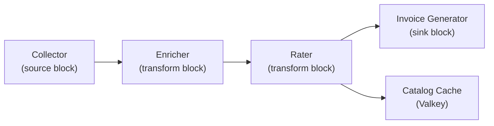

The rater block receives Arrow RecordBatches containing usage events (tenant_id,
resource_type, quantity, timestamp) and emits rated events with pricing
information appended (unit_price, amount, currency, charge_id, plan_id).

### 11.2 Catalog Cache

For hot-path performance, the rating block does not query PostgreSQL on every
event. Instead, catalog data is cached in Valkey (ADR-0002):

Valkey cache keys (examples):

| Key pattern | Value |
|-------------|-------|
| `catalog:plan:{plan_id}:v{version}` | Serialized plan and charges |
| `catalog:charge:{charge_id}:effective:{date}` | Effective charge at date |
| `catalog:tiers:{charge_id}` | Ordered tier list |
| `catalog:pricebook:{pricebook_id}:{charge_id}` | Currency-specific price |
| `catalog:resource_type:{name}` | Resource type definition |
| `catalog:metric:{slug}:v{version}` | Metric definition |

Cache invalidation strategy:

1. **Write-through on catalog update.** When a catalog entity is created or
   updated via the API, the API handler writes to PostgreSQL and updates the
   Valkey cache in the same operation.

2. **TTL as safety net.** Cache entries have a TTL of 5 minutes. Even if
   invalidation fails, stale data is bounded.

3. **Event-driven invalidation.** The Catalog API emits `catalog.changed` events
   via Valkey Pub/Sub (ADR-0002). All rating block instances subscribe to the
   `catalog.*` channel and invalidate their local cache entries upon receiving
   the event. Valkey is already in the stack for balance management, so no
   additional messaging infrastructure is required.

### 11.3 Re-Rating on Catalog Changes

When a catalog change takes effect (immediately or via scheduled effective date),
usage data within the affected period must be re-rated. The re-rating process:

1. The Catalog API emits a `catalog.rerate_required` event with:
   - `charge_id`, `plan_id`
   - `effective_start`, `effective_end` (the window requiring re-rating)
   - `affected_tenant_ids` (empty list = all tenants)

2. The re-rating orchestrator (a Celery task or block pipeline) queries the
   event store for usage events within the affected window.

3. The rating block processes these events against the updated catalog.

4. Rated events are updated in the billing ledger. If invoices have already been
   issued, credit memos or adjustments are generated.

### 11.4 Catalog Change Events

The catalog emits the following events on the `catalog.*` Valkey Pub/Sub channel:

| Event | Trigger | Payload |
|-------|---------|---------|
| `catalog.product.created` | New product | `{ product_id, slug }` |
| `catalog.plan.created` | New plan | `{ plan_id, product_id, version }` |
| `catalog.plan.version_created` | New plan version | `{ plan_id, old_version, new_version }` |
| `catalog.plan.deprecated` | Plan deprecated | `{ plan_id, version, successor_id }` |
| `catalog.charge.updated` | Charge modified | `{ charge_id, plan_id, changes }` |
| `catalog.pricebook.updated` | Price book entry changed | `{ pricebook_id, charge_id, currency }` |
| `catalog.change_scheduled` | Future change scheduled | `{ entity_type, entity_id, effective_start }` |
| `catalog.rerate_required` | Re-rating needed | `{ charge_id, plan_id, start, end, tenant_ids }` |

---

## 12. External Catalog Integration (Bring Your Own Catalog)

Meteridian's native product catalog (PostgreSQL plus Valkey pub/sub cache) is
the **system of record for rating**. The rating block on the hot path reads
catalog data from local cache; meters cannot apply rates without catalog entries
materialized in this canonical model. External systems are not queried live
during rating — that would violate latency and consistency requirements for
billing-grade accuracy.

Organizations that already maintain product definitions elsewhere can still use
Meteridian by **importing** external catalog data through the block runtime
(METR-0002, ADR-0007 block dataflow model). This is a **bring your own catalog**
pattern: the external source is authoritative for product *definition* in the
customer's organization; Meteridian's catalog is authoritative for *rating
execution*.

### 12.1 External Sources (Examples, Not Dependencies)

| Source | What it provides | Maturity / fit |
|--------|------------------|----------------|
| **[DCM Catalog Manager](https://github.com/dcm-project/catalog-manager)** | REST API for service types, catalog items, and instances — a hierarchical model for infrastructure service definitions (AEP-style, OpenAPI-driven). Aligns with sovereign/on-prem "data center as code" goals. | Early-stage open source (Go); focused on *provisioning* catalog semantics, not telco billing. Useful as a **reference adapter** for importing service SKUs into Meteridian plans. |
| **[OSAC](https://github.com/osac-project)** (Open Sovereign AI Cloud) | Self-service provisioning framework for OpenShift clusters and VMs — fulfillment APIs, operators, Ansible playbooks. Not a billing or product-catalog product. | Production-oriented at [Mass Open Cloud](https://massopen.cloud/); OSAC is an **infrastructure automation** stack, not an accounting catalog. Meteridian can consume OSAC *resource metadata* (cluster templates, VM SKUs) via custom sync blocks. |
| **TM Forum SID / TMF620** | Telecom industry product catalog vocabulary and REST patterns. | Meteridian's Catalog API already aligns TMF620 terminology (see [§10.4](#104-tmf620-alignment)). External TMF620 catalogs can map to Meteridian's flatter model. |
| **Stripe Products, ERP, custom YAML** | Commercial product master data. | Common in hybrid deployments; import via Source or Transform blocks. |

None of these are hard dependencies. They illustrate that **any system exposing
product or service definitions** (REST, GraphQL, GitOps files, message streams)
can feed Meteridian through a sync block.

### 12.2 Sync via Block Flow (Not Live Pass-Through)

Catalog integration follows the same block extensibility model as metering
pipelines (ADR-0007):

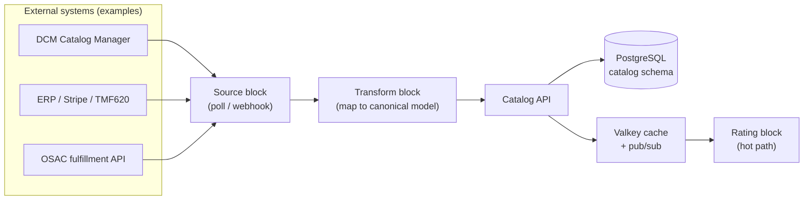

**Design rules:**

1. **Periodic or event-driven sync**, not per-event pass-through. A scheduled
   Source block (cron) or webhook-triggered Transform block pulls changes from
   the external catalog and upserts into Meteridian's `catalog.*` tables via the
   Catalog API (preserving effective dating and audit log semantics from
   [§7](#7-effective-dating-and-backdating)).

2. **Canonical model on write.** External entities map to Meteridian's
   Product → Plan → Charge → Tier → Price Book hierarchy (see
   [§3](#3-catalog-data-model)). Field mapping lives in the Transform block
   configuration (`block.toml` manifest, per METR-0002).

3. **Cache warm on change.** Successful imports emit `catalog.changed` on
   Valkey Pub/Sub so rating blocks invalidate local cache entries (see
   [§11.2](#112-catalog-cache)) before the next billing period.

4. **Idempotent imports.** Re-running a sync block with the same external
   revision must not create duplicate catalog versions; correlation IDs link
   bulk imports in `catalog.audit_log`.

### 12.3 Example: DCM Service Type to Meteridian Plan

DCM's `ServiceType` + `CatalogItem` model describes *what can be provisioned*
(CPU count, memory, GPU). A Transform block might map:

| DCM concept | Meteridian entity |
|-------------|-------------------|
| `ServiceType` (e.g. `compute.small`) | `Product` or `ResourceType` registration |
| `CatalogItem` (priced SKU) | `Plan` + `Charge` with `per_unit` or `tiered` model |
| `CatalogItemInstance` (provisioned resource) | Subscription linkage (tenant + plan), not catalog row |

Pricing on the DCM side (if any) becomes `PriceBookEntry` rows in the tenant's
settlement currency. DCM remains the provisioning catalog; Meteridian remains
the rating catalog.

### 12.4 Example: OSAC Template Metadata

OSAC does not ship rate plans. A Source block can read OSAC fulfillment API
responses (cluster templates, VM flavors) and register corresponding
`resource_type_mappings` ([§4.3](#43-provider-mappings)) so pod/VM usage events
normalize to canonical quantities before rating. Product marketing names and
commercial rates still live in Meteridian's catalog — OSAC supplies *capacity
semantics*, not prices.

### 12.5 Open Integration Points

- **`POST /api/v1/catalog/import`** (see [§10.2](#102-endpoints)) accepts JSON
  snapshots for bulk load; sync blocks may call this or use finer-grained CRUD.
- **Custom Transform blocks** for exotic sources (SAP, Salesforce CPQ) without
  upstream Meteridian changes — consistent with METR-0002's `block.toml`
  contract.
- **Webhook sink blocks** can push catalog change notifications back to external
  systems after Meteridian-side amendments (optional reverse sync).

---

## 13. Probabilistic Pricing Simulation (Moat Deepening)

### 13.1 Motivation

Current pricing simulation (what-if on historical data) answers "what WOULD HAVE happened." Probabilistic simulation answers "what WILL LIKELY happen" — using Monte Carlo methods on usage distributions to forecast revenue impact of pricing changes with confidence intervals.

Zuora shipped "AI Pricing Simulator" in June 2026. Meteridian's stochastic approach goes further: full distribution modeling rather than point estimates.

### 13.2 Usage Distribution Modeling

For each usage dimension, fit a statistical distribution from historical data:

```go
type UsageDistribution struct {
    Dimension    string          `json:"dimension"`
    Distribution string          `json:"distribution"`
    Parameters   map[string]float64 `json:"parameters"`
    FitMetrics   FitMetrics      `json:"fit_metrics"`
}

type FitMetrics struct {
    KSStatistic float64 `json:"ks_statistic"`
    AIC         float64 `json:"aic"`
    BIC         float64 `json:"bic"`
    SampleSize  int     `json:"sample_size"`
}
```

Supported distributions: Normal, Log-normal, Gamma, Poisson, Pareto (for heavy-tailed usage), mixture models.

### 13.3 Monte Carlo Simulation Engine

```go
type SimulationRequest struct {
    CurrentPlan     uuid.UUID           `json:"current_plan"`
    ProposedPlan    uuid.UUID           `json:"proposed_plan"`
    Cohort          CohortFilter        `json:"cohort"`
    Iterations      int                 `json:"iterations"`
    Horizon         string              `json:"horizon"`
    ConfidenceLevel float64             `json:"confidence_level"`
}

type SimulationResult struct {
    RevenueImpact   DistributionSummary `json:"revenue_impact"`
    ChurnRisk       DistributionSummary `json:"churn_risk"`
    MarginImpact    DistributionSummary `json:"margin_impact"`
    Percentiles     map[string]decimal.Decimal `json:"percentiles"`
    ConvergenceInfo ConvergenceInfo     `json:"convergence_info"`
}

type DistributionSummary struct {
    Mean   decimal.Decimal `json:"mean"`
    Median decimal.Decimal `json:"median"`
    StdDev decimal.Decimal `json:"std_dev"`
    P5     decimal.Decimal `json:"p5"`
    P25    decimal.Decimal `json:"p25"`
    P75    decimal.Decimal `json:"p75"`
    P95    decimal.Decimal `json:"p95"`
}
```

### 13.4 Digital Twin

A "digital twin" of the pricing engine that runs simulations without affecting production:
- Clones current rate plans, customer cohorts, and usage distributions
- Applies proposed changes in isolation
- Runs N=10,000+ iterations with sampled usage
- Reports revenue distribution with confidence intervals

### 13.5 Churn Elasticity Model

Price sensitivity estimation:
- Historical: correlate past price changes with churn events
- Configurable elasticity curves per customer segment
- Output: expected churn probability at each price point

### 13.6 API

```
POST /api/v1/pricing/simulate/monte-carlo    # Run full simulation
POST /api/v1/pricing/simulate/sensitivity    # Single-dimension sensitivity
GET  /api/v1/pricing/distributions           # Fitted usage distributions
POST /api/v1/pricing/distributions/fit       # Fit distribution to data
```

---

## 14. Open Questions

### 14.1 Catalog Storage Engine

**Question:** Should the catalog be stored in PostgreSQL (relational, strong
consistency, mature tooling) or TimescaleDB (time-series, native temporal
queries, hypertables for effective dating)?

**Arguments for PostgreSQL:**
- Catalog data is primarily relational (products → plans → charges → tiers).
- Strong consistency guarantees are critical for pricing data.
- Simpler operational model — no need to manage hypertable chunk intervals.
- Standard Django ORM / SQLAlchemy tooling works out of the box.

**Arguments for TimescaleDB:**
- Effective dating is a temporal query pattern that TimescaleDB optimizes.
- `time_bucket()` and continuous aggregates could accelerate simulation queries.
- The event store is already on TimescaleDB (ADR-0001), reducing operational
  surface.

**Current leaning:** PostgreSQL for the catalog, TimescaleDB for the event store.
The catalog is low-volume, high-consistency data. Effective dating can be
implemented with standard B-tree indexes on `(effective_start, effective_end)`.

### 14.2 Multi-Region Catalog Sync

**Question:** How should catalog data be synchronized across regions in a
multi-region deployment?

**Options:**
1. **Single-writer, multi-reader.** One region is the catalog authority; others
   replicate asynchronously. Simple but adds latency for cross-region catalog
   updates.
2. **CRDTs.** Use conflict-free replicated data types for catalog entities.
   Complex but eventually consistent without coordination.
3. **Distributed transactions.** Use a distributed SQL database (CockroachDB,
   YugabyteDB) for the catalog. Strong consistency but higher latency.

**Current leaning:** Single-writer for v1. Most catalog changes are infrequent
(pricing changes happen weekly or monthly, not per-second), so the latency of
cross-region replication is acceptable.

### 14.3 Catalog Cache Granularity

**Question:** What is the optimal caching granularity for catalog data in
Valkey?

**Options:**
1. **Per-tenant.** Each tenant's resolved plan (with inheritance, overrides) is
   cached independently. High memory usage but fastest lookups.
2. **Per-plan.** Plans are cached globally; resolution (inheritance, overrides)
   happens at lookup time. Lower memory but more computation per lookup.
3. **Global.** The entire catalog is cached as a single blob. Simplest
   invalidation but coarse-grained — any change invalidates everything.

**Current leaning:** Per-plan caching with lazy resolution. Plans change
infrequently enough that caching resolved plans per-tenant would waste memory.
Resolution (evaluating inheritance, applying overrides) is a lightweight
operation that can happen in-process.

### 14.4 Charge Model Extensibility

**Question:** Should the set of charge models (flat, per_unit, tiered, volume,
staircase, percentage, package, usage_minimum) be fixed or extensible?

**Arguments for fixed:** simpler rating engine, predictable behavior, easier to
test exhaustively.

**Arguments for extensible:** some industries need exotic pricing (e.g.,
time-of-day pricing for energy, dynamic pricing for ride-sharing, auction-based
pricing for ad tech). A block-based custom rater (METR-0002) could implement
arbitrary pricing logic.

**Current leaning:** Fixed set for v1, with the escape hatch being a custom
rating block in the pipeline for exotic pricing models.

### 14.5 Catalog Versioning Semantics

**Question:** When a plan is updated, should the new version automatically apply
to new subscriptions, or should it require explicit activation?

**Current leaning:** Explicit activation. Creating a new plan version puts it
in `draft` status. An explicit `POST .../activate` promotes it to `active` and
makes it the default for new subscriptions. This prevents accidental pricing
changes from affecting new customers.

---

## 15. References

1. **Zuora Product Catalog API** — https://developer.zuora.com/docs/api-references/api/overview/
   - Industry-standard hierarchical catalog model (Product → Rate Plan → Rate Plan Charge → Tier).
   - Effective dating via amendment lifecycle.
   - Multi-currency via currency-specific rate plan charges.

2. **Stripe Billing Products and Prices** — https://docs.stripe.com/billing
   - Simple two-level model (Product → Price).
   - Excellent developer experience but limited plan composition.
   - No native plan inheritance or effective dating.

3. **Orb Plan Configuration** — https://docs.withorb.com/
   - SQL-based billable metric definitions.
   - Composable price configuration with add-ons.
   - Primary inspiration for Meteridian's SQL-based metrics.

4. **TM Forum TMF620 Product Catalog Management API** — https://www.tmforum.org/resources/standard/tmf620-product-catalog-management-api-rest-specification-r19-5-0/
   - Telecom-industry standard for product catalog APIs.
   - Comprehensive entity model (40+ types) used as reference for terminology alignment.
   - Meteridian adopts a pragmatic subset.

5. **lago Billing Engine** — https://www.getlago.com/docs
   - Open-source billing with charge model flexibility.
   - Graduated, package, and percentage charge models.
   - Inspiration for Meteridian's open-source approach.

6. **Amberflo Usage-Based Billing** — https://docs.amberflo.io/
   - Real-time metering and rating pipeline.
   - Meter-centric catalog model.

7. **OpenMeter** — https://openmeter.io/docs
   - CloudEvents-native usage metering.
   - Demonstrates metering without a catalog — validates the need for a separate catalog layer.

8. **ISO 4217 Currency Codes** — https://www.iso.org/iso-4217-currency-codes.html
   - Standard for currency code representation.
   - Decimal precision and rounding rules by currency.

9. **European Central Bank Exchange Rates** — https://www.ecb.europa.eu/stats/policy_and_exchange_rates/euro_reference_exchange_rates/
   - Reference exchange rates for EUR-based conversions.
   - Free, daily-updated, widely used as a billing baseline.

10. **DCM Project (Data Center Management)** — https://dcm-project.github.io/
    - Open-source service catalog for infrastructure (Catalog Manager API).
    - Example external source for sync blocks; not a billing catalog.

11. **OSAC (Open Sovereign AI Cloud)** — https://github.com/osac-project
    - Sovereign AI cloud provisioning framework (OpenShift/VM fulfillment).
    - Infrastructure metadata source, not a product-rate catalog.
